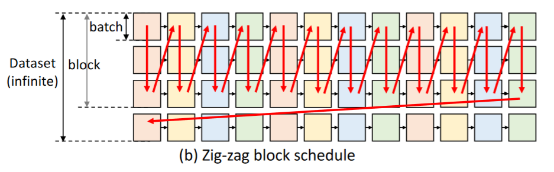
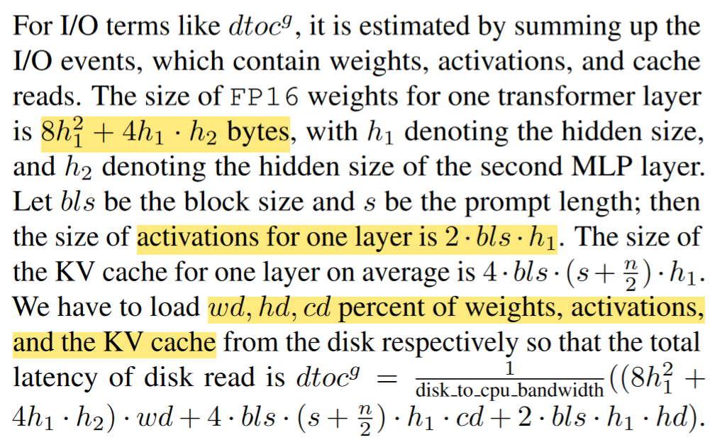

*[FlexGen: High-Throughput Generative Inference of Large Language Models with a Single GPU](https://dl.acm.org/doi/10.5555/3618408.3619696)[ICML’23]* 

以FlexGen作为LLM推理入门论文来说，是有些晦涩难懂的，所以论文解析中穿插着transformer的一些背景知识，还有与计算机体系结构方面的学习与思考。文章较长，但笔者写完茅塞顿开。

<!--more-->

针对LLM推理，减小计算和存储资源的三个方向：

（1）Model compression，即通过模型压缩技术减小模型占用的存储空间大小

（2）Collaborative inference，即去中心化(decentralization)的用多卡做模型并行

（3）Offloading，即把权重等参数从GPU内存卸载到CPU内存甚至硬盘中，还会用到模型量化技术。

由于FlexGen在arXiv上挂出来的时间比较长，算是LLM推理加速领域非常早的研究在内存受限的单个GPU环境中的高性能解决方案，并且FlexGen关注的是批量处理的对延迟不敏感的离线任务。这一问题背景也是FlexGen的作者敢大胆地将其设计成一个极度重视吞吐throughout的推理系统，导致延迟latency几乎完全被牺牲。这在论文强调的实验结果中可以看出，延迟已经被放大至3.3小时，这对于实时在线推理肯定是不适用的。

从一个初入门LLM推理加速方向的读者角度来看，FlexGen有两个非常亮眼的contribution。

第一个就是对LLM推理计算的量化分析（原文3 Background: LLM Inference）。FlexGen中在该章节中对**LLM推理两个阶段的计算量进行量化分析**，掌握这部分之后，才能继续阅读后续的Cost Model部分。具体包括LLM推理参数量、计算量、中间激活值、KV cache存储量和更新行为，还有generative token时序依赖等基本计算行为做了量化分析，同时也对LLM推理计算的**KV cache原理做了形式化描述**。

第二个contribution就是Offloading Strategy，包括两个部分：构建Search Space后通过cost model找到最佳卸载策略。

笔者将对上述两个contribution进行详细解读。

## LLM Inference Background

### P/D阶段计算

自回归推理的本质就是第$i$次注意力的计算都会重复计算前$i-1$个token的$K$和$V$值，因此目前LLM基本都加入了KV Cache，用于缓存当前轮次可重复利用的$K$和$V$值，以便在下一轮计算时直接读取缓存结果。

LLM的推理过程通常包含两个阶段：

（1）Prefill（预填充）：输入一个prompt序列，为每个transformer层生成 key cache 和 value cache（KV cache）

（2）Decoding（解码）：使用并更新KV cache，一个接一个地生成token，当前生成的token词依赖于之前已经生成的token

>在推理计算中，通常使用如下参数：
>
>$V$，词表大小；
$b$，训练数据的batch size；
>
>$a$，attention heads注意力头数；
$l$，transformer的层数layer;
>
>$s$，输入序列长度（sequence length）；
$n$，输出序列长度；
>
>$h$，hidden size，隐藏层维度；
$ih$，intermediate size，MLP块提升的维度；
>
>$h_1$，transformer的隐藏维度；
$h_2$，MLP的隐藏维度。

第$i$个transformer层的权重矩阵为$W^i_Q, W^i_K, W^i_V, W^i_O, W^i_1, W^i_2$。其中，self-attention块的4个权重矩阵$W^i_Q, W^i_K, W^i_V, W^i_O \in \mathcal{R}^{h \times h}$，并且MLP块的2个权重矩阵$W^i_1 \in \mathcal{R}^{h \times ih}, W^i_2 \in {\mathcal{R}^{ih \times h}}$。

FlexGen中的表示是：self-attention块的4个权重矩阵$W^i_Q, W^i_K, W^i_V, W^i_O \in \mathcal{R}^{h_1 \times h_1}$，并且MLP块的2个权重矩阵$W^i_1 \in \mathcal{R}^{h_1 \times h_2}, W^i_2 \in {\mathcal{R}^{h_2 \times h_1}}$。

#### 预填充阶段

假设第$i$个transformer层的输入为$x^i$，self-attention块的key、value、query和output分别表示为$x^i_K,x^i_V,x^i_Q,x^i_{out}$，其中，$x^i_K,x^i_V,x^i_Q,x^i_{out} \in \mathcal{R}^{b \times s \times h}$。FlexGen中此处为$h_1$。

key cache和value cache的计算过程为：

$$x^i_K = x^i \cdot W^i_K$$

$$x^i_V = x^i \cdot W^i_V$$

第$i$个transformer层剩余的计算过程为：

$$x^i_Q = x^i \cdot W^i_Q$$

$$x^i_{out} = softmax(\frac{{x^i_Q}{{x^i_K}^T}}{\sqrt{h}}) \cdot{x^i_V}\cdot{W^i_O}+x^i$$

以上是self-attention块的计算，包括计算$Q, K, V$以及计算attention分数。

接下来分析MLP块的计算，计算公式如下：

$$x^{i+1} = f_{gelu}(x^i_{out} \cdot W_1)\cdot W_2 + x^i_{out}$$

#### 解码阶段

给定当前生成词在第$i$个transformer层的向量表示为$t^i \in \mathcal{R}^{b \times 1 \times h}$，FlexGen中为$h_1$。解码阶段的计算分为两部分，即更新KV Cache和计算第$i$个transformer层的输出。

更新kv cache的计算过程如下：

$$x^i_K \gets Concat(x^i_K, t^i \cdot W^i_K)$$

$$x^i_V \gets Concat(x^i_V, t^i \cdot W^i_V)$$

第$i$个transformer层剩余的计算过程为：

$$t^i_Q = t^i \cdot W^i_Q$$

$$t^i_{out} = softmax(\frac{{t^i_Q}{{x^i_K}^T}}{\sqrt{h}}) \cdot{x^i_V}\cdot{W^i_O}+t^i$$

$$t^{i+1} = f_{gelu}(t^i_{out} \cdot W_1)\cdot W_2 + t^i_{out}$$

decoding phase阶段里，可以看出每层的input tokens只是做了一个拼接，这个拼接是在sequence size维度，不是把h1扩大到h1+h1了，就等于序列的tokens size +1，且历史的token序列$X_k, X_v$是没有更新的。

## 内存占用分析

### 模型参数量

Transformer模型由$l$个相同的层组成，每个层分为两部分：self-attention块和MLP块，并分别对应了一个layer normalization连接。

self-attention块的模型参数有$Q, K, V$的权重矩阵$W_Q, W_K, W_V$和偏置，输出权重矩阵$W_O$和偏置，4个权重矩阵的形状为$[h, h]$，4个偏置（bias）的形状为$[h]$。因此，self-attention块的参数量为$4h^2 + 4h$。

但实际上，目前大多数 LLM 的 Q、K、V 权重矩阵不再有偏置项，具体可参考[该解析](https://www.zhihu.com/question/645810022)。

> 现在很多LLM（比如 Llama）的所有模块（包括 FFN、attention 以及 LN/RMSnorm 等）都不设置 bias 项了。源于 Google 的 PaLM 发现去掉 bias 项可以增加训练的稳定性。No Biases - No biases were used in any of the dense kernels or layer norms. We found this to result in increased training stability for large models.

因此，如果没有偏置项，self-attention块参与训练的总参数量为$4h^2$。

https://blog.csdn.net/dongtuoc/article/details/140341886
补充FFN（也就是MLP）

MLP块由2个线性层组成，是一个先升维再降维的两个矩阵。一般地，第一个线性层是先将维度从$h$映射/升维到$ih$，第二个线性层再将维度从$ih$映射/降维到$h$。第一个线性层的权重矩阵$W_1$的形状为$[h, ih]$，偏置的形状为$[ih]$。第二个线性层的权重矩阵$W_1$的形状为$[ih, h]$，偏置的形状为$[h]$。因此，MLP块的参数量为$2h\cdot ih + ih + h$，其中$ih + h$为偏置的参数量。

通常$ih=4h$，即4稀疏，它决定了MLP块和transformer层的参数内存占用比，此时参数为$8h^2 + 5h$。如果没有偏置，则为$2h\cdot ih$，即$8h^2$。

self-attention块和MLP块各有一个layer normalization，包含了两个可训练模型参数：缩放参数$\gamma$和平移参数$\beta$，形状都是$[h]$。2个layer normalization的参数量是$4h$。

因此，每个transformer层的参数量为$4h^2 + 4h + 8h^2 + 5h + 4h = 12h^2 + 13h$。

除此之外，embedding（词嵌入）矩阵的参数量也需要计算，词向量维度通常等于隐藏层维度$h$，词嵌入矩阵的参数量为$Vh$。最后的输出层的权重矩阵通常与词嵌入矩阵是参数共享的。

因此，$l$层transformer模型的可训练模型参数量为$l(12h^2+13h)+Vh$。当隐藏维度$h$较大且远大于序列长度$s$时，可以忽略一次项，模型参数量近似为$12lh^2$。

对应到FlexGen中，令$h_1$为transformer的隐藏维度，$h_2$，MLP的隐藏维度。那么，attention块的模型参数量（无偏置）为$4h_1^2$，MLP块为$2h_1h_2$，即两个矩阵的参数大小，然后这两块参数都需要再乘以2字节（fp16），所以每个transformer块的参数量为：
$$2 \cdot (4h_1^2+2h_1h_2) = 8h_1^2 + 4h_1h_2$$
由于FlexGen中提到对模型参数占用的内存分析是粗略估计的，认为embedding layer(s)的参数相对其他的较小，所以对这部分进行了省略。

### KV Cache

KV-Cache本质上是用空间换时间，用于LLM的推理加速，存储的Key、Value矩阵会额外占用内存。
推理时缓存第$n$个token及前计算结果，第$n+1$个token相当于增量计算从而加速。

KV Cache的显存计算公式为：

$$2 \cdot precision \cdot n_{layer} \cdot d_{model} \cdot seq\_len \cdot batch\_size$$

（1）2是指 K 跟 V 俩矩阵

（2）$precision$ 是模型每个参数的字节数，比如 fp32 精度下每个参数 4 字节，fp16是2字节

（3）$n_{layer}$和$d_{model}$分别是模型层数和embedding维度大小

在输入prompt序列后，prefill阶段为每个transformer层生成key cache和v cache。此处我们需要明确其形状，其中$x^i \in [b,s]$，$W_k^i \in [h,s]$，$x^i_k \in [b,s,h]$这是简化后的单头（即$a=1$），多头时则为$[b,s,a,h/a]$。

按照原文中的假设，输入输出序列长度分别为$s, n$，以float16来保存kv cache，解码到最后一个token时长度为$s+n$，此时kv cache达到峰值，每层2个K/V各占用$(s+n)bh$。

那么kv cache的峰值显存占用大小为：
$$b(s+n)h \cdot l \cdot 2 \cdot 2 = 4blh(s+n)$$
其中，第一个 2 表示 k 和 v cache，第二个 2 表示 float16 数据格式存储 kv cache，每个元素占 2 bytes。此处，FlexGen中为$h=h_1$。

## Throughput And Latency

吞吐量的单位是token/s，表示每秒生成的token数量。 

generation throughput = generated tokens / (prefill time + decode time)，即$bn/t$，符号对应如上所述。

## Search Space

我们从宏观上来总结FlexGen的思想/步骤，其实是非常简单的，就是构造可能的参数（包括权重、激活和kv cache）卸载（三级存储层次结构GPU-CPU-Disk）策略的搜索空间，然后通过线性规划找到最优解，这与LLM training中auto parallelism的设计思想是相吻合的。但是对于要卸载多少参数到GPU，多少到CPU，多少到Disk，以形成一个高效率的“计算、数据读、数据写”的流水并行系统，需要找到最佳的卸载策略。

FlexGen对问题的前提描述如下：考虑一台具有三个设备的机器：GPU、CPU 和磁盘。 GPU和CPU可以执行计算，而磁盘则不能。这三个设备形成三级内存层次结构，其中 GPU 具有最小但最快的内存，磁盘具有最大但最慢的内存。当LLM无法完全放入GPU时，我们需要将其卸载到辅助存储，并通过部分加载LLM来逐部分执行计算。

直观的看，遍历的方式无非就是row-by-row或col-by-col。

逐行执行是指每一层在处理输入的每个token时，都先完成当前token计算后，再移动到下一个token的计算。这意味着对于每一层，其所有token的计算是分阶段完成的，并且需要保持该层的权重在内存中。现有的LLM Serving Framework基本都是逐行执行的，这是合理的，因为这是完成一批生成的最快方式，并且KV cache可以在一行之后立即释放。然而，由于每两个相邻的方块不共享权重，因此该调度必须重复加载权重并产生巨大的 I/O 成本。

为了减少权重的 I/O 成本，我们可以逐列遍历图表。列中的所有方块共享权重，因此我们可以让权重保留在 GPU 上以供重用，并且仅加载/卸载激活和 KV 缓存。然而，我们无法将一列一直遍历到最后，因为仍然需要存储激活和 KV 缓存。因此，当它们填满 CPU 和磁盘内存时我们必须停止。

考虑到上述所有不足之后，FlexGen将两者结合，变成了zig-zag的并行策略。

在搜索空间中引入了2个参数，一是GPU batch size（$gbs$），二是GPU batches in a block。
Effective batch size 也叫 Block size($bls$) = GPU batch size * GPU batches in a block

一个block也就是一个effective batch size的输入数据(prompt)。所谓Compute schedule指的就是如何去计算一个block的算法，算法描述如下：

### LLM推理计算图

FlexGen构建了一个推理计算图，如下所示。其中模型有4层，每个prompt生成3个token。该图中一个正方形就表示一层的GPU批次的计算，相同颜色的正方形共享相同的权重。

根据上面抽象出来的推理计算图，要设法在图中找出一条能够最小化执行时间的路径，其中包括在设备之间移动张量时的计算成本和 I/O 成本。

### zig-zag并行策略

### Block Schedule with Overlapping算法

## Cost Model

我们趁热打铁，直接跳转到cost model部分，一个用来预估推理时延和内存占用的数学模型。对于前面的部分，
假设此时已经确定了search space中的候选路径后，FlexGen通过线性规划模型对其进行优化，其目标是找到最优的资源分配策略，使得推理总时间最小化。考虑了以下几个变量：

<ul>
<li>GPU批处理大小，即gbs</li>
<li>块大小，即一个块中包含的GPU批次数量，即bls</li>
<li>权重、激活值和kv cache在GPU、CPU和磁盘之间的分配比例</li>
</ul>

#### 计算时间估计

cost model分别估算了prefill和decode两个阶段的执行时间：

（1）$T_{pre}$，每层transformer的prefill时间，考虑了从CPU到GPU的读取时间、GPU到CPU的写入时间、磁盘到CPU的读取时间等；

（2）$T_{gen}$，每层transformer的decode时间，考虑了I/O开销。

因此，模型的总推理时间为：
$$T = T_{pre} \cdot l + T_{gen} \cdot (n-1) \cdot l$$
其中，$l$为模型层数，$n$为生成的token数目。

FlexGen提供了一个非常理想化的pipeline执行系统，假设系统中的“计算、数据读、数据写”的延迟可以完全overlapping，$T_{pre}$可以表示成：
$$T_{pre}=\max(ctog^g,gtoc^g,dtoc^g,ctod^g,comp^g)$$
其中各参数分别表示一层解码过程中，CPU读到GPU、GPU写到CPU、磁盘读到CPU、CPU写到磁盘、计算的时延。

以下是FlexGen中计算磁盘到CPU拖取数据的耗时的量化结论。

对于像这样的I/O术语，可以通过将包含权重、激活和缓存读取的I/O事件相加来估计。

$dtoc^g$就是GPU在计算生成下一个token时，需要通过流水线操作链给GPU输送数据时，从磁盘到CPU需要耗费的延迟。因此有一部分参数可能存放在磁盘上，需要把这些数据搬运到CPU端。在这个过程中需要用到下一层的张量占比表示为：权重$wd$，激活$hd$和kv cache $cd$。

根据前面的分析，可知一层transformer（fp16）的模型参数量为$8h_1^2+4h_1h_2$字节。
kv cache的峰值显存占用大小为$b(s+n)h_1 \cdot l \cdot 2 \cdot 2 = 4blh_1(s+n)$
这是总量，但对于每一层来说（即取平均值），$seq\_len=s+\frac{n}{2}$，因此：

$$2 \cdot 2 \cdot l \cdot h_1 \cdot (s+\frac{n}{2}) \cdot b $$

block与前面的并行策略有关，

对于中间激活的显存占用，我们

在模型的前向传播过程中，必须存储中间激活值。这些激活值代表了神经网络中每层的数据在向前传播时的输出。它们必须保持为 FP32 格式，以避免数值爆炸并确保收敛。激活的计算公式为：

Activation Memory = Batch Size * Sequence Length * Hidden Size * (34 + (5 * Sequence Length * Number of attention heads) / (Hidden Size))

## Policy Search

***Maybe: A soul without imagination is like an observatory without the telescope!***

***

BGM：

<ul>
<li>Lily -- 李健</li>
<li>不该 -- 周杰伦 张惠妹</li>
<li>野火 -- 戾格</li>
<li>亲爱的，那不是爱情 -- 张韶涵</li>
</ul>

# Reference

[1] [分析transformer模型的参数量、计算量、中间激活、KV cache](https://zhuanlan.zhihu.com/p/624740065)

[2] [大模型推理优化技术-KV Cache](https://zhuanlan.zhihu.com/p/700197845)

[3] [大模型推理性能优化之KV Cache解读](https://zhuanlan.zhihu.com/p/630832593)

[4] [模型参数量及显存分析](https://clvsit.github.io/%E6%A8%A1%E5%9E%8B%E5%8F%82%E6%95%B0%E9%87%8F%E5%8F%8A%E6%98%BE%E5%AD%98%E5%88%86%E6%9E%90/)

[5] [How to Estimate the Number of Parameters in Transformer models](https://towardsdatascience.com/how-to-estimate-the-number-of-parameters-in-transformer-models-ca0f57d8dff0)

[4] [Flexgen LLM推理计算环节的量化分析](https://zhuanlan.zhihu.com/p/615327112)

[5] [Flexgen LLM推理 CPU Offload计算架构到底干了什么事情](https://zhuanlan.zhihu.com/p/615021309)

