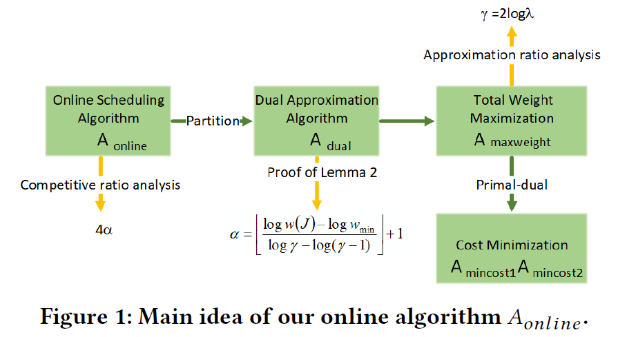

本文是对香港大学Wu Chuan老师、武汉大学Li Zongpeng老师和东南大学Zhou Ruiting老师在Online Scheduling of DML Jobs方向的一系列相关研究的总结。DML即分布式机器学习(Distributed Machine Learning)。

<!--more-->

具体包括：

1. Online Job Scheduling in Distributed Machine Learning Clusters[[INFOCOM'18]](https://ieeexplore.ieee.org/stamp/stamp.jsp?tp=&arnumber=8486422)(CCF A)

2. Online Scheduling of Heterogeneous Distributed Machine Learning Jobs[[Mobihoc'20]](https://i2.cs.hku.hk/~cwu/papers/qzhang-mobihoc20.pdf)(CCF B)

3. DPS: Dynamic Pricing and Scheduling for Distributed Machine Learning Jobs in Edge-Cloud Network[[TMC'22]](https://ieeexplore.ieee.org/stamp/stamp.jsp?tp=&arnumber=9847354)(CCF A)

4. Preemptive Scheduling for Distributed Machine Learning Jobs in Edge-Cloud Networks[[JSAC'22]](https://ieeexplore.ieee.org/stamp/stamp.jsp?arnumber=9791406)(CCF A)

5. Dynamic Pricing and Placing for Distributed Machine Learning Jobs: An Online Learning Approach[[JSAC'22]](https://ieeexplore.ieee.org/stamp/stamp.jsp?tp=&arnumber=10043656)(CCF A)

6. Online Scheduling of Distributed Machine Learning Jobs for Incentivizing Sharing in Multi-Tenant Systems[[TC'22]](https://ieeexplore.ieee.org/stamp/stamp.jsp?tp=&arnumber=9774009)(CCF A)

从应用场景上进行划分，可分为：GPU集群场景、云边协同场景

从研究内容上进行划分，可分为：任务调度、任务定价

从调度目标上进行划分，可分为：提升系统训练效率（包括最小化任务完成时间、最大化系统效用、最大化社会福利）、公平性

从调度方式上进行划分，可分为：抢占式、非抢占式

从技术手段上进行划分，可分为：数学优化、基于AI（如强化学习）

## 应用场景

### GPU集群

近期，针对GPU数据中心场景中的机器学习训练任务，提出了大量的调度器。对于这部分工作的总结，可详见新加坡南洋理工大学S-Lab的Wei Gao博士于2022年发表在arXiv的一篇综述：Deep Learning Workload Scheduling in GPU Datacenters: Taxonomy, Challenges and Vision[[PDF]](https://arxiv.org/pdf/2205.11913.pdf)[[Code]](https://github.com/S-Lab-System-Group/Awesome-DL-Scheduling-Papers)。但是Survey包含的是2022年之前的工作，对于目前最新的研究，还需要自己去搜索。

对于大部分调度器都是基于GPU集群环境设计的原因，笔者在此对survey中的阐述进行总结：机器学习通常由模型训练和模型推理组成，每个阶段都需要高性能的硬件资源（GPU和其他计算系统）来生成和服务于生产级别的ML模型。因此，IT行业和研究机构普遍建立GPU数据中心来满足其日益增长的ML开发需求。

另一个解释可参考阿里[[22'NSDI]](https://www.usenix.org/system/files/nsdi22-paper-weng.pdf)：为了大规模加速ML工作负载，科技公司正在使用大量GPU设备构建快速并行计算基础设施，通常由多个用户共享，以提高利用率并降低成本。这些大型GPU集群运行各种ML工作负载(例如，训练和推理)，为ML-as-a-service(MLaaS)云提供基础设施支持。

参考国防科技大学Chen Chen发表在[[IPCCC'22]](https://ieeexplore.ieee.org/stamp/stamp.jsp?tp=&arnumber=9894345)的论文，GPU集群的特点总结如下：
<ol>
<li>数据传输延迟大：GPU集群通常由管理节点、存储节点和计算节点组成。为了加速分布式训练，集群中的服务器和GPU之间通常通过InfiniBand等高速互连的网络进行通信。同时，GPU集群通常使用HDFS、GFS和ClusterFS等分布式文件系统，来用于GB级别的大文件的传输。然而，ML任务具有大量需要传输的小文件，这将大大降低系统的I/O性能。因此，在ML训练的准备期间需要很长时间来传输数据。</li>
<li>存在数量丰富的短期任务：商汤科技的生产数据分析报告显示，用户提交了大量的短期任务，如代码调试，只需要很短的时间执行，并且只需要消耗少量的资源。此外，大多数短期任务只需要使用一个GPU。</li>
</ol>

>笔者后续会阅读微软[[ATC'19]](https://www.usenix.org/system/files/atc19-jeon.pdf)、商汤[[SC'21]](https://arxiv.org/pdf/2109.01313.pdf)、阿里[[22'NSDI]](https://www.usenix.org/system/files/nsdi22-paper-weng.pdf)等商业级的机器学习生产集群报告，然后来补充。

而对于GPU集群场景下ML任务训练的挑战，可直接参考Survey[[PDF]](https://arxiv.org/pdf/2205.11913.pdf)的2.2.2章节，作者已经总结的非常详细。

### 云边协同

近期，云边协同场景受到了广泛关注。简单来说，云边协同将云计算与边缘计算紧密地结合起来，通过合理地分配云计算与边缘计算的任务，实现了云计算的下沉，将云计算、云分析扩展到边缘端。

>云边协同详细讲解：https://www.51cto.com/article/703471.html
>
>云边协同为什么非常重要：https://www.zhihu.com/question/330509383

最初了解到这个新的计算范式，是在Zhou Ruiting老师的两篇论文中：DPS[[TMC'22]](https://ieeexplore.ieee.org/stamp/stamp.jsp?tp=&arnumber=9847354)和Preemptive[[JSAC'22]](https://ieeexplore.ieee.org/stamp/stamp.jsp?arnumber=9791406)（笔者后续会对这篇文章进行详细解读）。

为了深入了解这个新计算范式的背景和发展，在B站上学习了KubeEdge的论文讲座，其中中国科学技术大学的谈海生老师和天津大学的王晓飞老师的讲解对我的帮助很大。谈老师主要从他们的现有工作出发，王老师主要从云边协同的背景和研究意义出发。

>[第一届云原生边缘计算学术研讨会B站链接](https://www.bilibili.com/video/BV1iP411u7La/?spm_id_from=333.788&vd_source=e092b13f32ccf57ffa840f905bb9dd08)

另外，关于云边端协同/边缘计算支持的人工智能研究，笔者阅读了三篇相关综述，按照时间顺序排列，分别是清华大学Ren Ju老师（2022年“达摩院青橙奖”）于2022年发表在网络领域顶刊地位的IEEE Communications Surveys & Tutorials上的一篇综述[[PDF]](https://ieeexplore.ieee.org/stamp/stamp.jsp?tp=&arnumber=9933792)、浙江大学Deng Shuiguang老师于2020年发表在通信领域非常好的期刊IEEE IOTJ上的一篇综述[[PDF]](https://ieeexplore.ieee.org/stamp/stamp.jsp?tp=&arnumber=9052677)[[相关解读]](https://zhuanlan.zhihu.com/p/548163593)[[相关研究基础]](https://www.zhihu.com/question/319330609/answer/912407391)以及中山大学Zhou Zhi老师于2019年发表在Proceedings of the IEEE上高被引的一篇综述[[PDF]](https://ieeexplore.ieee.org/stamp/stamp.jsp?tp=&arnumber=8736011)。

参考Zhou Ruiting老师的两篇论文，云边协同场景特点及其对DML任务调度造成的挑战总结如下：
<ol>
<li>边缘服务器靠近数据源，传输延迟低，是放置ML任务的首选。但边缘服务器上的资源通常是稀缺且异构的，因此可能会导致任务分配的所有节点（以PS架构为例）无法部署在同一台边缘服务器上，从而造成worker与PS之间的频繁通信，继而影响任务的完成时间。</li>
<li>由于云数据中心与用户之间的链路较长，并且在数据传输的过程中受到网络带宽等因素的影响，从而导致服务延迟较大。但中央/远端云服务器上的计算资源通常非常丰富，任务使用的worker和PS可以轻松地共同托管在云上。</li>
</ol>

## 研究内容

### 任务调度

第一篇论文是香港大学的Yixin Bao博士于2018年发表在通信网络领域顶会INFOCOM上的一篇论文。现有的大型分布式机器学习集群的任务调度器，如[Borg](https://dl.acm.org/doi/pdf/10.1145/2741948.2741964)、[YARN](https://www.cse.ust.hk/~weiwa/teaching/Fall15-COMP6611B/reading_list/YARN.pdf)，通常都是由用户提交任务的资源配置情况，并且由于这些调度系统的默认调度策略大部分都是FIFO、DRF和基于优先级的贪婪方法，导致系统不允许任务在训练过程使用不同数量的并发的worker，而是一直保持不变，直到训练完成。对于DML任务来说，这种静态的资源分配方式无法充分利用ML集群的资源，从而阻碍最佳的训练速度。此外，由于分布式机器学习模型训练通常是资源密集型且非常耗时的，这种方式也会导致增加训练成本，使整个训练过程变得更加昂贵。因此，ML集群运营商面临的一个基本挑战是如何有效地安排用户提交的训练任务，以最大限度地利用可用的服务器资源（尤其是昂贵但性能强大的GPU资源），并加速任务的训练过程。为了解决这个问题，该文章设计了一个在线算法OASiS,用于采取异步训练的任务在线接纳控制和调度。OASiS为每个任务计算其训练的最佳schedule，并在每个时隙动态调整任务使用的worker数量，以实现最佳的资源利用率和任务训练性能。同时，根据精心设计的资源价格函数来决策任务是否被接纳(任务的训练效用为正则接受)，以实现系统的长期效用最大化。

>对于资源价格函数的具体解释，可以直接看第三篇论文DPS。

第二篇论文是第一篇的扩展版，由武汉大学的硕士研究生Zhang Qin于2020年发表在CCF B类会议Mobihoc上，其[硕士毕业论文](https://kns.cnki.net/kcms2/article/abstract?v=3uoqIhG8C475KOm_zrgu4lQARvep2SAkueNJRSNVX-zc5TVHKmDNkhVTI-rLezILhi59bbSeEHVY4TrV4vU87TmzgzQaiVSS&uniplatform=NZKPT)可在中国知网搜索到。这是笔者阅读的分布式机器学习任务的调度优化方向的第一篇论文，受益很大。记得初读这篇文章时，颇为吃力，只觉得整篇文章为了求解出问题而进行的转换既巧妙又可行，在阅读了整整一周之后，才将这篇论文全部读懂（仅从笔者理解的角度）。

该论文以DML任务的资源需求弹性特征为切入点研究DML任务调度问题，其中资源需求弹性可解读为不同资源配置下DML任务所需的完成时间不同。论文2是论文1的扩展，论文1中只考虑了任务使用的并发的worker数量，论文2增加了对于单个任务来说采取不同类型的worker和PS可能性的考虑。不同类型的节点，比如不同类型的GPU、CPU等。论文1考虑的是异步的数据并行训练，任务使用的worker和PS放置在不同的物理服务器上，论文2增加了对任务的所有节点放置在同一台物理服务器上的考虑。

对于第二篇论文来说，大部分篇幅都用来进行问题的转换，以求解出该目标下的一个可行解。该论文提出了一个在线算法`A_online`，当每个任务在线到达时，该算法会决策任务的执行窗口（就是在哪个时隙执行任务）、并发的worker和PS的数量和资源配置（即类型），从而最大程度地减少任务平均完成时间。具体来说，该论文将原在线优化问题（总加权完成时间最小化问题）通过一个数学引理，转化为一个离线的总权重最大化问题，并由离线问题的对偶α-近似算法转化为原在线问题的4α–近似算法，从而得到在线问题的可行解（笔者认为作者团队对于数学求解方法的积累是有一定深度的）。在求解离线最优问题的过程中，使用了**紧凑-指数优化**技术进行问题重写（笔者会在下面的技术手段部分详细说明），然后将总权重最大化问题转换为成本最小化问题，从而为每个任务决策出一个最佳的调度方案。

### 任务定价

第1、2、3、5篇paper中都涉及到了任务定价的部分。其中，第1、2篇是在问题的转换过程中涉及了价格函数的涉及，主要是为了求解数学模型，而不是作为一块具体的研究目标和研究内容。

对于任务动态定价的详细内容，可直接阅读两篇DPS论文，也就是第3、5篇。由于笔者目前重点关注的是任务的动态调度和弹性训练，所以对于此部分，不做过多赘述。

简单来说，以PS架构为例，现有的任务调度器可能会造成任务的worker和PS被放置在不同的物理服务上，从而加大任务运行时间的不确定性。而现有的云定价策略通常是根据任务的运行时间来收取固定的价格，这种"pay-as-you-go"的定价策略虽然简单，但不适合运行时间随机的DML任务，只能根据完成任务放置后的位置来估计用户需要支付的费用。因此，为了解决上述问题，Zhou Ruiting老师基于拍卖机制，分别以社会福利最大化和云服务提供商利润最大化为目标，设计了动态的任务调度和定价算法。

第5篇论文是在第3篇论文基础上，增加使用Multi-Armed Bandit(MAB)技术来学习基于过去销售的未知信息。

## 调度目标

关于调度目标，非常好区分。

第1、2、3、4、5篇都是以最小化任务完成时间为目标，具体的表现形式不同，如1为最大化系统效用、2为最小化所有任务的加权完成时间、3为最大化社会福利、4为最小化任务完成时间、5为最大化服务提供商利润。

第6篇追求的是多用户之间的公平性。

## 调度方式

关于调度方式，笔者是按照是否考虑抢占来划分的。

除第四篇论文外，其余几篇都是没有考虑资源抢占的。

这部分的内容，也就是对于第四篇论文的详细解读，笔者会在后续单独写一篇博客。

## 技术手段

### 数学优化

由于模型的约束条件中涉及集合和自然语言描述部分，采用了一种“紧凑-指数（compact exponential）优化技术”，简单来说，就是将满足约束条件的决策变量集合编码到一个变量中，这个新变量集合的可能取值情况数量为指数级，也就是说，在ILP问题中引入了指数级的变量，每个变量对应任务的一个可能的调度方案。通过紧凑-指数优化技术将原问题模型重写为传统打包结构的ILP问题，且由于时间复杂性的问题，直接求解这个紧凑指数的ILP问题是不可行的，所以又利用对偶和松弛等方法进行问题的求解。

这个技术手段首次出现在Zhou Ruiting老师于2017年发表在IEEE/ACM Transactions on Networking期刊上论文“An Efficient Cloud Market Mechanism for Computing Jobs With Soft Deadlines[[PDF]](https://core.ac.uk/download/pdf/95559144.pdf)”中。并在第2、3、6篇论文的模型求解过程中使用到了该技术。

由于笔者只在网上找到了该项技术的学术报告摘要部分[[链接]](https://www.wust.edu.cn/jsjkx/2020/0525/c1584a216541/page.htm)。从这里可以发现设计“紧凑-指数优化技术”的motivation：

>“李宗鹏教授介绍，计算机科学中很多重要的优化问题是NP-hard复杂度。其中部分问题可以表示成0-1整数线性规划问题，并使用primal-dual框架设计有效的近似算法。这种primal-dual思想对约束条件的形式有较强的限制。研究过程中，他所在团队尝试通过引入新的算法思想设计思想来打破这一限制，扩大primal-dual算法的适用范围。”

### 基于AI

除第五篇论文外，其余几篇论文都是使用数学优化方法来求解模型。第五篇中设计了一种基于[MAB](https://www.jianshu.com/p/efb723420ee6)框架的在线学习策略，以实现对未知输入的估计，并根据任务运行时间的反馈计算奖励值。

## 写在最后

笔者对于分布式机器学习训练任务的调度优化方向的了解与学习就是Wu Chuan老师、Li Zongpeng老师和Zhou Ruiting老师的这几篇论文开始的。正如笔者在上面所说，初读之时十分痛苦，细读之后觉得巧妙无比，反复阅读之后不断思考自己如何写出类似的高质量的论文。只能说，还需努力啊！

***Maybe: The Beginning Of Learning Is Painful Because You Are Thinking!***

***

BGM：
<ul>
<li>再见深海（微亮的瞬间）--唐汉霄</li>
<li>我记得 --赵雷</li>
</ul>
