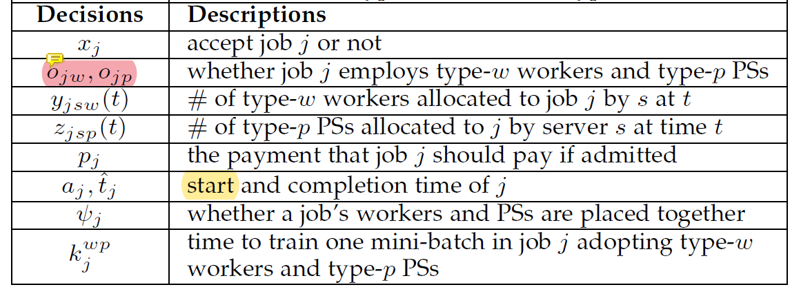

笔者在一段较长的时间里都苦恼于如何求解问题，探索了很多种方法，这个过程真的是繁琐又苦恼啊。最近刚好看到2023-Infocom中一篇由北邮博士Wang Fei作为第一作者发表的云边系统中应急需求响应的资源调度论文，里面使用的方法依然是之前笔者多次提到过的“紧凑-指数”优化技术。其本质是将多个具有耦合性的决策变量组合在一起，将任务调度问题抽象为组合优化问题去求解。这种方法最初是由周睿婷老师于2017年提出的，即使过去这么多年了，从笔者作为一个硕士的视角去看，这个方法依然没有old。因此，笔者以周老师发表2022年发表于TMC上的论文DPS和其学生Wang Ne博士于2023年发表在TC上的论文Astraea为例，对该方法进行详细解析。

<!--more-->

要想掌握该方法，笔者认为应该解决以下三个问题：

**1、整个算法的流程是什么？**

算法的目标是什么？每一个步骤的目标、输入输出、已知/未知信息是什么？每一步要算什么、怎么算？

**2、每个任务的可行调度方案集合是怎么来的？**

每个可行调度方案指的是什么？怎么拿到的？其中包含哪些元素？每个元素是如何确定的？

**3、价格函数的设计以及更新？**

物理含义是什么？每一项是怎么计算的？每一项代表什么意思？如何更新价格函数？更新后又需要做什么？

## Q1：整体算法流程

图1：算法流程结构

整体目标：社会福利最大化（详情请见论文）

整体问题：当一个新的任务请求$j$在线到达时，系统/服务提供商需要立即决策能否接受它，如果接受，需要收取多少费用？

总体步骤：在每个任务请求到达时，调度算法$A_{bestsche}$来寻找最佳调度方案，并根据当前价格计算出相应的成本。如果任务的效用大于成本（即$\mu_j > 0$），就接受请求并根据价格函数来更新价格，反之拒绝该任务请求。

以下是具体步骤：

### Step1：计算每个新任务的最优调度方案及其任务效益

目标：最大化任务效益$\mu_j$

输入/已知：任务$j$的输入/投标信息$B_j$，服务器$s$上$w/p$类型的worker/ps的资源容量$C_{sw}/C_{sp}$，服务器$s$上$t$时隙已经分配的$w/p$类型的worker/ps的资源数量$q_{sw}(t)/h_{sp}(t)$，任务j的时隙变化范围$t \in [r_j, \hat{t_j}]$

输出/需要求：任务$j$的最佳调度方案$l^*$及其相应的任务效益$\mu_j$

怎么算：本质是固定一些变量，然后遍历剩余变量的全部情况，取出其中最好的即可

（1）把worker/ps的类型、任务开始训练时间和需要分配的worker数量组成一个元组$(w,p,a_j,D_w)$，并枚举出这个元组的全部方案。其中，任意的$w \in [W]$，$p \in [P]$， $a_j \in [r_j, T]$，$D_w \in [1, D_j]$。

（2）固定某个元组$(w,p,a_j,D_w)$，并将其作为参数来调用两种任务放置算法（集中式和分布式），以计算不同放置假设下的最小资源成本$cost$和相应的调度方案$l$。此时，任务的完成时间是可以计算出来的。

任务的执行时长：

其中${k^{wp}_j}$的值在确定了放置策后可以根据文中Eq.(1)直接计算出来。

任务的完成时间：$\hat{t_j}=a_j+d_j$

（3）比较两种放置假设下的所有可选的调度方案所获得的任务效用（真实价值-运行成本），并确定其中实现最高效用的最佳的调度方案。注意：只有当新的调度方案的收益大于当前的方案时，才更新为当前最优的调度

此处可以跳转到Q2处，看到这一步了，每个任务$j$的每个可行调度方案$l$确定了哪些元素。

### Step2：给定信息下利用贪心策略计算worker和ps的最优部署方案

目标：最小化资源使用成本

输入/已知：所有的元组$(w,p,a_j,D_w)$，$t$时隙服务器s上$w/p$类型的worker/ps资源的单价$\alpha_{sw}(t)/\beta_{sp}(t)$

输出/需要求：每个元组对应的最小资源使用成本cost和对应的调度方案l 

怎么做：

（1）给定某一元组$(w,p,a_j,D_w)$，计算出对应的任务的执行时间$d_j$和完成时间$\hat{t_j}$

（2）集中式放置：按照资源使用成本的非递减顺序对相应的服务器进行排序并要求这些服务器是满足任务传输延迟约束（即只使用在$a_j$前能够到达的服务器）、计算资源容量约束的。然后分配PS（一个）能够满足带宽覆盖约束即可；

（3）分布式放置：

①按照worker价格$\alpha_{sw}(t)$的非递减顺序对服务器进行排序，并从最便宜的服务器开始尽可能多的部署worker，并尊重资源容量约束和worker数量约束;

②根据最后使用的服务器将服务器分为两组。带宽覆盖约束中表明只需要一台服务器来部署PS。对于前一组，PS的数量由资源容量约束、带宽约束和其他ps分配约束限制。对于后一组，如果把原本放在前一个组的服务器上的一个worker移动到后一组中的一个服务器上后资源成本下降了，那么就尽可能多的把worker转移过来

将该元组的所有调度方案都存储在$L$中，最后从$L$中选出成本最小的调度方案$l$就是最优的

## Q2：每个任务的可行调度方案集合

任务$j$的每一个可行调度方案$l$对应一个满足约束条件(2)-(9)(12)-(15)(16a)的决策变量集合，除计算资源容量约束外。具体的约束见原文。同时，$l$中包含的决策变量如下所示：

图2：决策变量集合

（1）到step1这一步确定的是$(w,p,a_j,D_w)$，相对应就确定了该任务的处理能力$k^{wp}_j$，然后根据两种放置策略可以分别计算出不同元组对应下的任务的执行时间$d_j$和完成时间$\hat{t_j}$。具体来说，绝对确定的决策变量是$o_{jw},o_{jp},k^{wp}_j,a_j$。

（2）到step2这一步确定两种不同的放置假设下，具体的资源分配情况，即绝对确定的决策变量是$\varphi_j,y_{jsw}(t),z_{jsp}(t),\hat{t_j}$。

## System deduction process case

笔者在只根据算法流程对任务的调度流程进行推演时，总是对价格函数的更新部分思考不通，于是带入了一个具体的案例去推演整个系统的流程。案例写的非常详细，根据案例即可对该方法有了非常明确的了解。由于Markdown文件的排版因素，案例放在文中的最下面了。主要参考了DPS和Astraea来设定。

## At the End

其实使用该方法的论文是比较多的，比如Prof.Ruiting Zhou以及Prof.Lei Jiao，他们在多篇论文中都使用该方法来求解多个具有耦合关系的决策变量。在笔者角度，这个方法并没有过时，虽然距离Prof.Ruiting Zhou提出并将其命名为“紧凑-指数优化”技术已经6-7年的时间了，但其本质思想就是一个组合优化的解决思路。所以该方法是非常值得学习的。

***

BGM：

<ul>
<li>余震，尘埃落定 --- 张敬轩</li>
<li>心之科学，搜神记 --- 容祖儿</li>
</ul>

***
案例具体内容如下：

<embed src="System-deduction-process-case.pdf" width="100%" height="750" type="application/pdf">