本文是对分布式机器学习训练中如何支持弹性训练的一系列工作的总结。弹性训练指的是在任务的训练过程中动态调整任务的并行度（即GPU的数量）和资源分配情况。在阅读本文之前，笔者建议对GPU集群中深度学习训练任务的调度问题具有一定的了解，可以阅读笔者之前写过的两篇文章，分别是[Deep Learning Workloads Scheduling in GPU Clusters](https://qingweiji.github.io/2023/04/08/Deep-Learning-Workloads-Scheduling-in-GPU-Clusters/)和[Online Scheduling of DML Jobs](https://qingweiji.github.io/2023/03/21/Online-Scheduling-of-DML-Jobs-from-ChuanWu-And-Ruiting-Zhou/)。

## Gang-Scheduling VS. Elastic-Scheduling

分布式机器学习或深度学习训练(DLT)任务有两种调度方式：[gang-scheduling](https://dl.acm.org/doi/10.1145/3458817.3476223)(群调度)和[elastic-scheduling](https://arxiv.org/pdf/2205.11913.pdf)(弹性调度)。

其中，gang-scheduling要求任务在训练时所有算力资源（主要是GPU）以all-or-nothing（全有或全无）的方式来分配。gang-scheduling方式的缺点是非常明显的。通常，为了利用海量数据训练深度学习，分布式多GPU训练是必不可少的。多GPU训练任务在使用gang-scheduling方式调度时，除非所有需要的GPU同时可用，否则任务不会开始训练。然而，在忙碌的生产集群环境中，GPU资源很难同时得到满足。同时，在等待全部请求GPU的过程中，已经分配的 GPU 既不会执行任务，也不会释放给其他用户使用。比如，当一个用户申请四张卡，当前只有三张是空闲的，那么调度器就需要留住这三张卡，不调度给别的任务，等待最后一张卡就绪，从而把这个四张卡一起分配出去。此外，gang-scheduling调度方式下，训练任务是在固定的并行度(DoP)下执行的，因此当集群负载发生变化时，它无法进行GPU数量的扩展或者缩小。

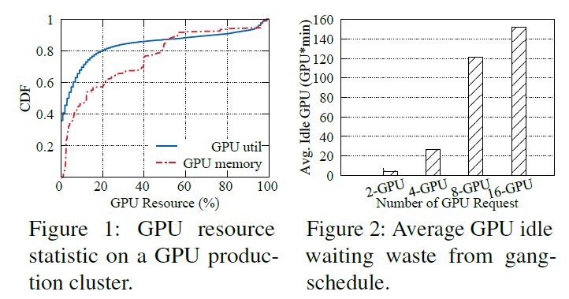

图1：gang-scheduling下的GPU利用率[1]

相比之下，elastic-scheduling消除了严格的不变的GPU请求数量（初始请求）的约束，通过支持允许动态调整训练任务并行度（即GPU数量）的能力，以提高GPU利用率并加速训练过程。弹性训练的本质是基于DLT任务的弹性伸缩能力，具体包括两点：一是DLT任务的资源需求通常是弹性的，简单来说，就是在不同资源配置下（不同数量的GPU）任务所需的执行时间不同；二是在深度学习训练过程中可以利用[[checkpoint]](https://i.cs.hku.hk/~cwu/papers/yhpeng-eurosys18.pdf)等机制实现模型训练的暂停与恢复。

## Strengths vs. Weaknesses of elastic-scheduling

### Strengths or Benefits?

**1、支持灵活、动态的资源分配与任务管理**

（1）改变现有集群调度器的静态的资源分配方式，即期望用户在提交任务时指定具体的资源配置（如GPU的类型和数量），这种方式非常依赖任务所有者的工程经验，如果配置的资源过量，会造成资源的浪费，如果配置的资源过少，会降低任务的训练速度和性能；

（2）可以通过stop-resume等机制，实现将worker(PS架构)从一台服务器迁移到另一台，以减少资源碎片化；

（3）对于同步并行训练中的掉队者问题，可以通过scale-in技术从任务分配的资源中删除

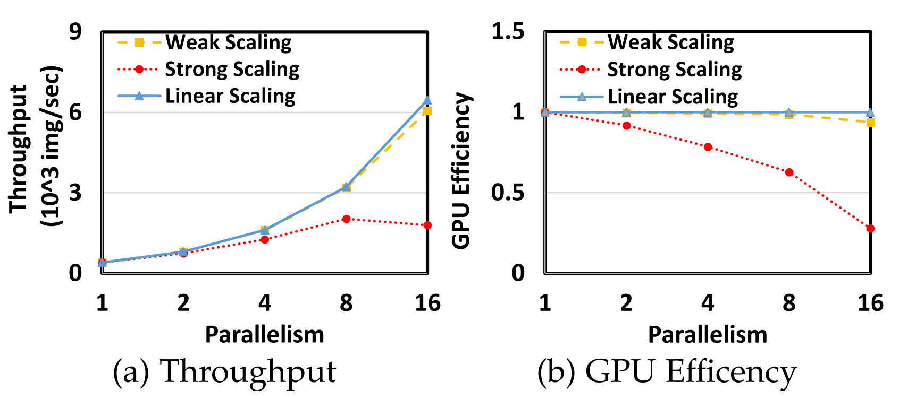
图2：并行性对ResNet50的影响[2]：线性扩展是一种理想的情况，它假设吞吐量与并行度呈线性扩展，我们将其作为参考

图2结果表明，DL训练通常可以使用不同的并行度（即不同数量的GPU）处理任务，并且吞吐量和GPU训练效率都随着并行度而变化。因此，弹性可用于根据集群调度的不同目标（例如，更短的JCT、更高的吞吐量或GPU效率）动态调整DLT任务的并行性[[2]](https://ieeexplore.ieee.org/abstract/document/9373916)

**2、适应集群负载变化**

由于传统集群调度器使用gang-scheduling，导致资源无法充分利用。在使用elastic-scheduling之后，调度器可以根据集群的负载变化来动态调整分配给任务的资源量，即可以在集群不忙时或者暂时具有空闲资源时增加任务的并行度以实现高吞吐，加速训练过程，并在集群繁忙时降低并行度以提高集群的训练效率。

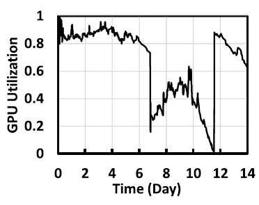

图3：GPU集群可能在很长一段时间内负载过重，而在其他时间内利用率不高[2]

**3、提高任务的响应能力/降低响应延迟（队头阻塞问题）**

有些DLT任务是长期训练任务，完成任务训练可能需要持续几天甚至几周，这些长期任务通常也会请求数量较多的GPU资源。根据微软、阿里、商汤的生产集群数据报告分析可知，集群中存在大量的短期训练任务，这些小型任务通常用于程序正确性检查、参数配置调整和网络体系结构搜索，对响应能力提出了要求，属于best-effort(尽力而为)的任务。然而，集群中由于长期训练任务对于资源的占用引起的对头阻塞问题（head-of-line blocking）会严重降低小型任务的响应能力，比如等待小型任务调度的时间比实际运行这些小任务的时间长很多。这同样也是由传统的gang-scheduling引起的问题之一。通过使用elastic-scheduling的scale-in技术来减少一些长期训练任务占用的GPU资源量，以便在集群过载时为小型任务腾出空间，也加速小型任务的快速执行，降低响应延迟。

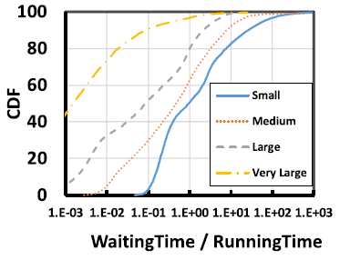

图4：不同体量任务的（等待时间/运行时间）比率的累积分布函数[2]

### Weaknesses or Motivations?

最近，一系列的研究工作（如[TorchElastic](https://github.com/pytorch/elastic)、[ElasticDL](https://github.com/sql-machine-learning/elasticdl/)、[Elastic Horovod](https://github.com/horovod/horovod/blob/master/docs/elastic.rst)）提出了支持弹性训练的深度学习框架，允许DLT任务在训练过程中动态地扩展其资源量（即GPU数量）。一些为GPU集群中的DLT任务量身定制的调度器（如Gandiva[[3]](https://www.usenix.org/conference/osdi18/presentation/xiao)、Optimus[[4]](https://i.cs.hku.hk/~cwu/papers/yhpeng-eurosys18.pdf)、Tiresias[[5]](https://www.usenix.org/system/files/nsdi19-gu.pdf)）利用了GPU资源弹性来最大化集群的资源利用率或分配资源来实现快速收敛。

尽管业界都已对弹性训练的优势心知肚明，并做了非常多的尝试与探索。但事实上，目前所提出的弹性深度学习训练框架并没有广泛的应用在实际生产中。这主要是因为DLT任务和共享的GPU集群的独特特征对获得上述弹性训练的优势提出了挑战。

**1、弹性训练导致模型精度的不确定[6]**

GPU资源弹性在模型训练过程和模型收敛过程中引入了不确定性，导致一个DLT任务在使用不同份额的资源进行训练时，得到的模型精度不一致。

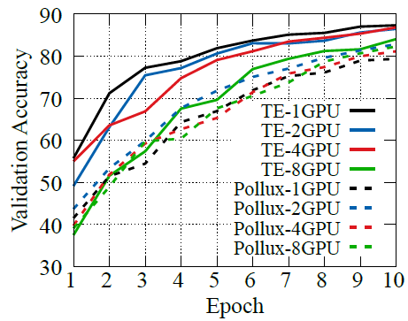

图5：ResNet18的非确定性精度曲线[6]

对于图5的解释，可以直接参照原文：

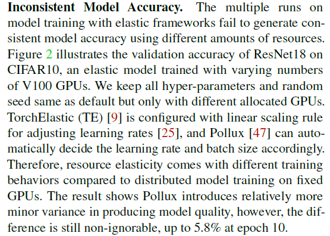

**2、stop-resume机制带来了额外的操作开销[2,7]**

为了支持弹性训练，DLT任务可以通过stop-resume来暂停和恢复训练。但是，弹性训练应该是在低开销下进行的，以支持任务训练过程中频繁的并行度调整并有效地利用暂时空闲的GPU资源。大多数DL系统都支持stop-resume机制，但正在运行的任务通常需要停止30秒以上，这种高开销限制了集群调度器快速适应动态资源可用性和任务训练需求的能力。同时，高开销也阻碍了对暂时空闲资源的有效利用。

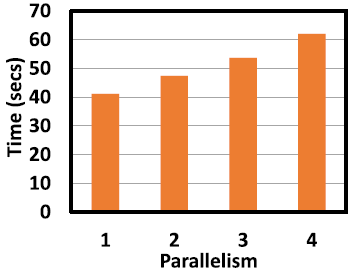

图6：使用stop-resume的开销[2]

**3、弹性训练框架应该与现有的DL系统兼容并容易上手操作**

现有的深度学习系统，如TensorFlow、PyTorch、MXNet等已经被广泛使用，因此设计的弹性调度系统应该是基于上述广为应用的深度学习框架来建立的，而不需要从头开发一个新系统。此外，从使用者的角度来说，在弹性调度系统中运行其提交的DLT任务的操作应该简单容易上手操作，在任务训练过程中调整并行度也应该简单且快速。

## How to support elastic-scheduling?

笔者首先对一些系统级别的工作中如何支持弹性训练的相关技术手段进行分析与总结，这些大部分发表在系统领域的顶会NSDI/OSDI中。

***Gandiva[3]***

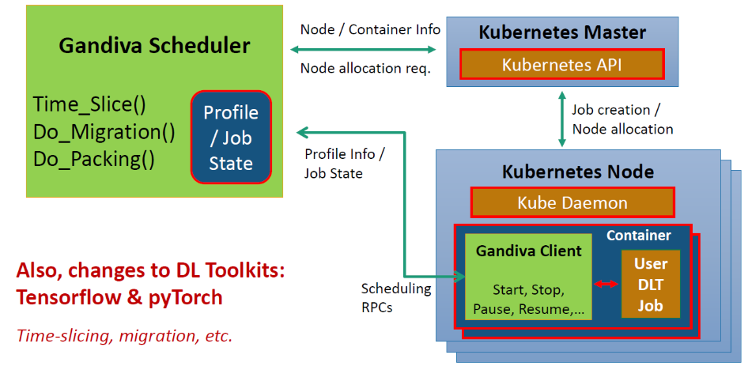

图7：Gandiva系统实现

Gandiva设计了一种*Grow-Shrink*机制，主要用于适应集群的负载变化。具体来说，该机制使用profiling的信息来估计每个任务的训练进度，进而为任务分配GPU资源。从普适的观点出发，对于大部分的训练任务，分配到的算力资源越多，模型完成训练需要的时间就会越少。因此，在集群负载较小时，分配给某一任务的GPU数量就会增多(grow)；反之，则会减少(shrink)。

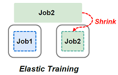

图8：实现弹性训练[8]

>对于Gandiva系统的具体分析，可以参考网上公开的论文解读，如：https://zhuanlan.zhihu.com/p/347789271

***Optimus[4]***

Optimus基于在线的资源-性能模型，来实现最小化任务完成时间。整个调度器的优化方法包括三个部分：DLT任务性能建模、资源分配算法、任务放置算法。

首先，Optimus通过使用在线拟合模型来调度任务以预测训练模型的运行时间。性能模型分为：任务收敛模型和资源-速度模型。任务收敛模型用于预估一个DLT任务还需要多少次迭代之后才能够达到收敛状态。资源-速度模型用于拟合一个DL任务的资源配置和训练速度之间的关系。其中，资源指的是分配给一个DLT任务的PS和worker的数量，而每个PS和worker的具体资源配置（CPU等）则是由用户事先配置好的；速度指的是每个单位时间内能够完成的训练迭代次数。通过整个性能模型就可以估算出一个DLT任务所需的收敛时间。其次，Optimus设计了一个贪婪的资源分配方案，优先考虑最大限度地减少边际损失。这种贪婪策略成功地最大化了集群范围内的训练吞吐量。

Optimus通过上述两个步骤对一个DLT任务使用的PS和worker数量进行改变，从而实现任务的弹性训练。

>对于Optimus更加全面的了解，可以参考网上公开的论文解读，如：https://zhuanlan.zhihu.com/p/138132572

***Pollux[9]***

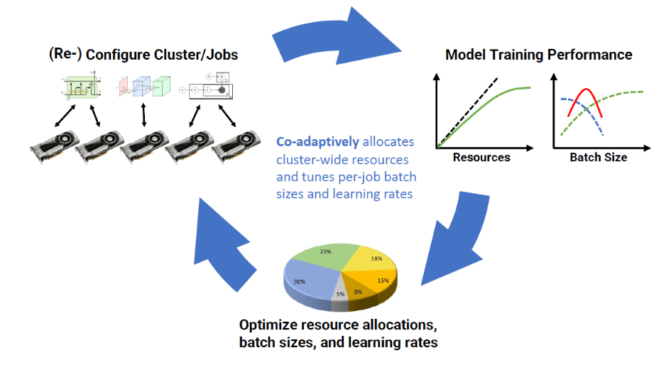

图10：Pollux集群调度器

Pollux不仅从GPU资源弹性方面，还从训练框架方面，联合提供支持DLT任务的弹性训练能力。

Pollux通过观察每个DLT任务的训练状态和集群的资源利用情况，实时地作出如下决策：（1）调整每个任务的批处理数据大小和学习率，在文中表述为batch size和learning rate；（2）重新/动态分配集群资源（如 GPU）。

作者在对产学界的主流调度器进行分类：尺度自适应的调度器（scale-adaptive）和非自适应的调度器（non-scale-adaptive）。

<ul>
<li>非自适应的调度器：要求用户在提交作业时指定所需要的资源数量，且不会随着任务的状态调整资源的分配。例如，Tiresias[OSDI '19]和 Gandiva[OSDI'18]等。</li>
<li>自适应的调度器：主动调整资源分配。例如，Optimus[EruoSys '18] 训练了一个系统吞吐量关于各作业资源分配状态的预测模型，并根据这个模型调整资源的配比，从而最小化 JCT。此外还有 Gavel [OSDI'20]、AntMan[OSDI '20]、Themis[NSDI'20]。</li>
</ul>

因此，作者从这些工作的问题出发，设计了Pollux，不仅给出资源的动态分配方案，还调整模型训练的超参数，这也是Pollux能够取得更好的训练性能的原因。

具体来说，Pollux定义了一个新的metric：goodput，而不是throughput。goodput是一个综合衡量训练性能的指标，包括系统吞吐量(system throughput)和工作效率(statistical efficiency)。作者认为，一个正确配置的深度学习训练任务应当在以下两个指标之间取得平衡。

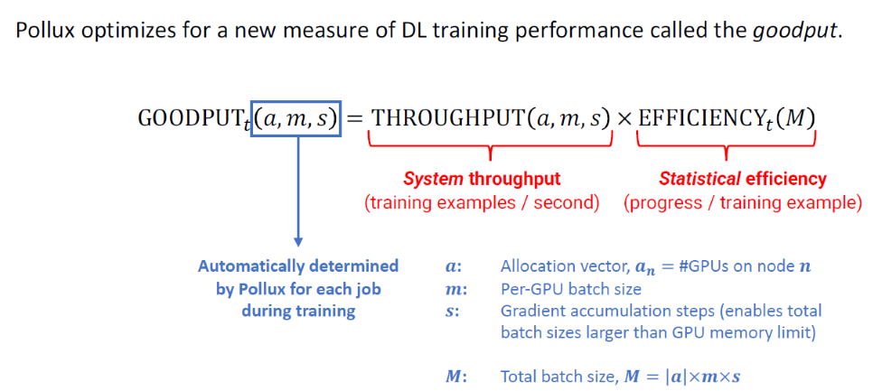

图11：Pollux集群调度器的关键idea：Goodput，而不是Throughput

其中，系统吞吐量可以用 “每单位时钟时间内处理的训练样本数量” 进行测算；工作效率可以用 “每个被处理的训练样本所产生的训练进度量” 来衡量。个人理解这两个指标分别对应模型的训练速度和模型的收敛速度。其原文表述为：
>The system throughput of DL training can be defined as the number of training samples processed per unit of wall-clock time；
>
>The statistical efficiency of DL training can be defined as the amount of training progress made per unit of training data pro- cessed, influenced by parameters such as batch size or learning rate

当一个任务被重新分配资源后,Pollux会相应地调整任务的batch size和learning rate。但是实际操作时,这些都是非常难调整的。因为在通常情况下,如果分配给某个任务的资源越多,那么增大该任务的batch size就可以提高系统吞吐量,但工作效率会影响的显著下降。因此,在调整这两个超参数时时通过最大化goodput来平衡这两个指标的影响的。

>对于Pollux更加全面的了解，可以参考网上公开的论文解读，如：https://hliangzhao.cn/articles/000001632804098b0d15f52e2794eba809f483763f603b1000。
>
>该博客的作者是浙江大学邓水光教授团队的Zhao Hailiang博士，Zhao博士对于这篇论文的分析对笔者启发性很大。

***EDL[2]***

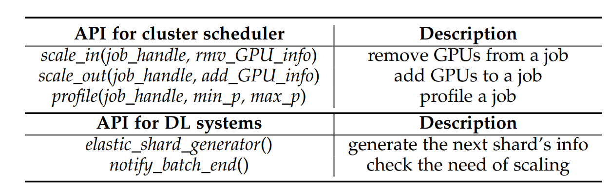

图12：EDL的关键API

如图12所述，EDL通过scale-in/out技术来调整任务使用的worker的数量，即可以指示EDL使用一个简单的API删除/添加训练任务的任何worker。

与上述工作不同，EDL旨在保障任意一个worker在加入/离开任意一个DLT任务时的正确性和高效性。并且，为了减少并行调整的开销，EDL使用stop-free scaling来隐藏scale_out时由于任务准备带来的高开销，并应用graceful exit来减小scale_in过程的开销。

>对于EDL更加全面的了解，可以参考网上公开的论文解读，如：https://zhuanlan.zhihu.com/p/107621278

***Online Scheduling[10,11,12]***

还有一些工作是对在线到达的DLT任务采用弹性训练机制进行调度优化。这部分工作主要是香港大学的Wu Chuan老师团队和原武汉大学（现东南大学）的Zhou Ruiting老师团队的相关工作。笔者之前从其他角度出发，对部分相关工作进行了梳理，具体可参考[[blog]](https://qingweiji.github.io/2023/03/21/Online-Scheduling-of-DML-Jobs-from-ChuanWu-And-Ruiting-Zhou/)。相关工作主要是OASiS[10]和AOnline[11,12]，它们通过建立数学优化模型(即建立ILP模型)对任务调度问题进行求解，然后利用如Primal-Dual框架来求解模型。这些工作对于弹性训练的支持体现在DLT任务训练期间，在系统工作的每个时隙，调度器会重新计算并分配每个任务独占的worker的数量。

笔者仅对一些非常经典的相关工作进行了总结与分析，对于其他工作的更加全面的了解，可以参考南洋理工大学S-Lab的Gao Wei博士撰写的一篇Survey[[PDF]](https://arxiv.org/pdf/2205.11913.pdf)，笔者在前几篇博客中也已经多次提及。

## How to implement elastic-training?

笔者目前正在参考[GitHub - kzhang28/Optimus: An Efficient Dynamic Resource Scheduler for Deep Learning Clusters](https://github.com/kzhang28/Optimus)，学习如何搭建基于深度学习框架的K8S调度系统，后期会针对这一部分专门写一篇博客供大家参考。

## At the End

近期，Elastic-Training已经成为产业界和学术界共同关注的一个非常重要且具有发展潜力的话题，也相继产出了多篇高质量的paper。经过一段时间的学习，笔者对于探索如何在各种不同的应用场景中使用多样化的技术手段实现训练任务的elastic-trainging具有极大的兴趣，期望无论是在理论支撑还是系统实现方面都有所进益。

***Maybe：Interest Is the Best Teacher!***

***

BGM：

<ul>
<li>去有风的地方 -- 郁可唯</li>
<li>画沙 -- 袁咏琳/周杰伦</li>
<li>那个女孩 -- 韩庚</li>
<li>陪我长大 -- 段奥娟</li>
</ul>

## References

[1]Xiao W, Ren S, Li Y, et al. AntMan: Dynamic Scaling on GPU Clusters for Deep Learning[C]//OSDI. 2020: 533-548.  

[2]Wu Y, Ma K, Yan X, et al. Elastic deep learning in multi-tenant GPU clusters[J]. IEEE Transactions on Parallel and Distributed Systems, 2021, 33(1): 144-158.

[3]Xiao W, Bhardwaj R, Ramjee R, et al. Gandiva: Introspective cluster scheduling for deep learning[C]//13th {USENIX} Symposium on Operating Systems Design and Implementation ({OSDI} 18). 2018: 595-610.

[4]Peng Y, Bao Y, Chen Y, et al. Optimus: an efficient dynamic resource scheduler for deep learning clusters[C]//Proceedings of the Thirteenth EuroSys Conference. 2018: 1-14.

[5]Gu J, Chowdhury M, Shin K G, et al. Tiresias: A GPU Cluster Manager for Distributed Deep Learning[C]//NSDI. 2019, 19: 485-500.

[6]Li M, Xiao W, Sun B, et al. EasyScale: Accuracy-consistent Elastic Training for Deep Learning[J]. arXiv preprint arXiv:2208.14228, 2022.

[7]Chen C, Chen Y, Chen Z, et al. PickyMan: A Preemptive Scheduler for Deep Learning Jobs on GPU Clusters[C]//2022 IEEE International Performance, Computing, and Communications Conference (IPCCC). IEEE, 2022: 120-129.

[8]Gao W, Hu Q, Ye Z, et al. Deep Learning Workload Scheduling in GPU Datacenters: Taxonomy, Challenges and Vision[J]. arXiv preprint arXiv:2205.11913, 2022.

[9]Qiao A, Choe S K, Subramanya S J, et al. Pollux: Co-adaptive Cluster Scheduling for Goodput-Optimized Deep Learning[C]//OSDI. 2021, 21: 1-18.

[10]Bao Y, Peng Y, Wu C, et al. Online job scheduling in distributed machine learning clusters[C]//IEEE INFOCOM 2018-IEEE Conference on Computer Communications. IEEE, 2018: 495-503.

[11]Zhou R, Pang J, Zhang Q, et al. Online scheduling algorithm for heterogeneous distributed machine learning jobs[J]. IEEE Transactions on Cloud Computing, 2022.

[12]Wang N, Zhou R, Jiao L, et al. Preemptive Scheduling for Distributed Machine Learning Jobs in Edge-Cloud Networks[J]. IEEE Journal on Selected Areas in Communications, 2022, 40(8): 2411-2425.

