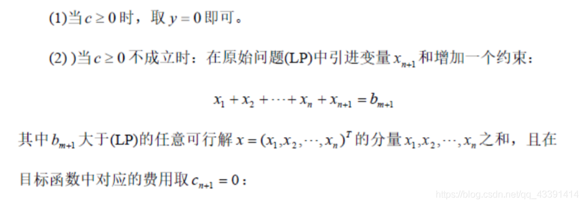
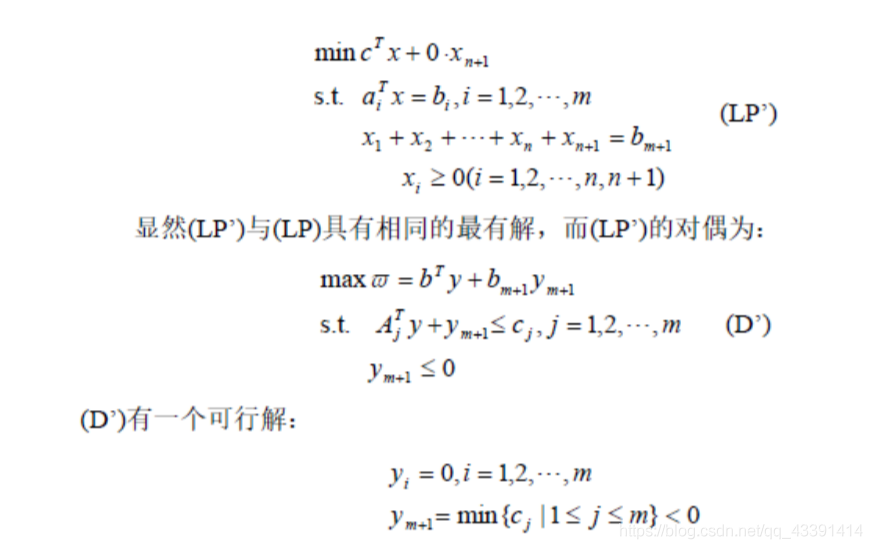
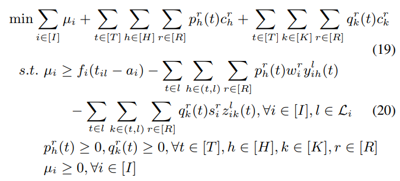

本文是笔者本学期旁听的一门博士算法思维课程的相关笔记。本文主要对基于LP(Linear Programming，线性规划)的近似算法，以Primal-Dual为例进行深入分析与总结。笔者主要使用来自香港大学的Wu Chuan老师和东南大学的Zhou Ruiting老师的几篇采用了Primal-Dual方法来求解的论文辅助分析与理解。

该课程由电子科技大学信息与通信工程学院王晟老师开设，王晟老师在算法分析与设计方面具有多年的理论基础与实践经验，其授课风格也是笔者非常欣赏的，务实有用且融会贯通。笔者常常在听完一节课后感叹课程开设的时间实在是太短了，也经常在听讲过程中多次发掘自己需要学习的东西还非常多。

## 算法的基本概念[1]

***定义1：***

一个最优化问题$\Pi$指的是一个最大/小化问题，$\Pi$的每一项实例$I$都有一个非空的可行解集合（即可行域），其中任一可行解都对应着一个非负实数（即目标函数值）。因此，一个组合最优化问题$\Pi$指的是一个可行域为有限集合的最优化问题。

***定义2：***

一个最优化问题被称为NP-Hard的，如果所有NP类问题都可以在多项式时间归约为此问题。

最优化问题$\Pi$的一个多项式时间算法被成为精确算法，如果它可返回$\Pi$的任一实例的最优解。

最优化问题$\Pi$的一个多项式时间算法称为$\Pi$的一个近似算法，如果对给定的$\Pi$的一个实例$I$，它可返回$I$的一个非最优解的可行解。

***定义3：***

最优化问题$\Pi$的近似算法$A$的近似比（也称为性能比、近似因子、相对误差）为$\rho(n)$，如果对$\Pi$的任一实例$I$：$|I|=n$，$A$可返回$I$的一个可行解，且其目标函数值$A_I$满足$max{\left \{ {\frac{A_I}{OPT_I},\frac{OPT_I}{A_I}}\right \}} \le{\rho(n)}$。此时，称$A$为$\Pi$的一个$\rho(n)$-近似算法。

其中，$OPT_I$表示最优化问题$\Pi$的实例$I$的最优值。需要注意：近似比$\rho(n)$总是一个不小于1的数（或函数）；$\rho(n)$越小，近似程度越好；特别地，当$\rho(n)=1$时，算法$A$即为一个多项式时间精确算法。

***定义4：***

最优化问题$\Pi$的一个算法族${A_{\epsilon}}$称为$\Pi$的一个多项式时间近似方案(polynomial-time approximation schema，PTAS)，如果对任意给定的$\epsilon>0$，算法${A_{\epsilon}}$都是$\Pi$的一个$(1+{\epsilon})$-近似算法。

## 基于LP的近似算法[2]

基于LP的近似算法主要分为三类：线性规划舍入(LP Rounding)、原始对偶(Primal-Dual)和局部搜索(Local Search)。其中，LP Rounding和Primal-Dual算法基于LP松弛技术。

### LP Rounding

首先需要给出原问题的ILP(Integer Linear Programming，整数线性规划)模型，然后求解相应的LPR(Linear Programming Relaxation，线性规划松弛)问题得到最优的分数解。通常会根据可行性要求对分数最优解进行改造，最后在（改造的）分数解的基础上构造原问题的整数可行解。因此，LP Rounding的方法需要求解线性规划，所以不是组合算法。虽然LP Rounding是设计近似算法的利器，但应用起来并不容易。

### Primal-Dual

如果不是对LPR问题进行直接求解，而是设计组合算法给出对偶问题的可行解，并根据该对偶可行解的信息对构造原始问题的证书可行解，通过与对偶可行解比较得到算法的近似比，则称此类算法为Primal-Dual算法。该算法有两个优点：一是该算法时组合算法，可以揭示问题的组合结构；二是该算法具有鲁棒性，容易移植到其他变形问题上。此外，对偶拟合(Dual Fitting)算法可以看作Primal-Dual算法的变形，该算法用组合算法构造对偶解 (不一定可行) 使得费用与原始整数可行解的费用相同, 通过将对偶解一致缩小得到对偶可行解, 同时缩小的系数即为近似比.

### Local Search

在局部搜索算法中, 给定初始可行解, 定义适当的邻域, 通过引入恰当的调整策略, 在邻域中得到改进的可行解,依次迭代下去, 直到按照给定的调整策略不能改进为止。

**原始对偶模式是设计近似算法的首选方法，因为它通常给出具有良好近似保证和良好运行时间的算法。其基本思想是处理NP-Hardd问题及其对偶的LPR问题，然后迭代变换原解和对偶解，直到满足松弛的原始对偶互补松弛条件。因此，Primal-Dual算法的优点在于，它避免了求原始线性规划问题的最优解所耗费的大量时间，从而减少了算法的运行时间。特别是，对于需要求解在线问题的论文来说，如果要求快速求解LP问题的最优解是非常不现实的，利用P-D算法所能带来的加速效果就是必需的了。因此，本文主要对Primal-Dual算法进行深入分析与讨论。**

## 基于Primal-Dual的算法设计

### 算法设计原则

（1）始终保持对偶可行, 追求主可行

    主可行：始终保持主解为整数, 但直至算法结束, 才能覆盖所有元素。

（2）两个互补松弛条件中，一个被保持，另一个被近似满足

    要点：Primal-Dual算法不需显式求解LP, 但需要LP对偶理论的指导
    (PS：如果不知道LP对偶，那么就无法完全理解Primal-Dual)。

>注意：近似程度就是最终算法的近似比

由LP对偶理论可知：主可行+对偶可行+满足所有互补松弛条件=最佳解。但是对于NP-Hard问题，显然不能指望这些条件同时满足。

### 算法设计基础

#### LP对偶

以一个具体的例子进行说明，方便后面理解：

图1：某机器加工厂在计划期的设备和产品加工信息

原问题：在计划期内，自己生产，使得利润最大。设为生产产品1的数量，为生产产品2的数量。因此，原问题可以写为：

$max \quad z=50{x_1}+100{x_2}$

$s.t. \left\{\begin{matrix} {x_1+x_2 \le 300}
 \\ 2x_1+x_2 \le 400
 \\ x_2 \le 250
 \\ x_1,x_2 \ge 0
\end{matrix}\right.$

>公式都是左对齐的原因是笔者使用的是Latex行内公式的显示方式，而非行间公式，笔者在网上找了很多办法，都无法实现行间公式的正常显示，反而出现如果行间公式正常显示，则Latex的花括号则无法正常显示。

对偶问题：现在有另一个机器厂想要租用你的机器，他们厂的设备使用饱和（或者说很多货）或者他们愿意按使用了机器所有工时支付你钱款。设$y_1,y_2,y_3$分别是你对设备A、B、C的报价，规划问题如下：

$min \quad \omega=3300{y_1}+400{y_2}+250{y_3}$

$s.t. \left\{\begin{matrix} y_1+2y_2 \ge 50
 \\ y_1+y_2+y_3 \ge 100
 \\ y_1,y_2,y_3 \ge 0
\end{matrix}\right.$

    结论1：任何一个LP问题都存在一个对偶问题
    结论2：对偶问题的对偶问题就是原问题

所以，可以通过这个例子简单总结如何由一个最大化问题转化为其对偶问题：

（1）目标函数改为最小化

（2）$x_i \ge 0$对应约束条件$\ge$，$x_i$无约束对应约束条件 $=$

（3）原约束条件$\le$对应$y_i \ge 0$，原约束条件 $=$ 对应$y_i$无约束

>补充一点说明：以前笔者研一的时候上过数学学院开设的最优化课程，但是由于在授课时讲述的大部分是如何利用不同的方法来求解一个问题，而非结合具体的例子来弄清楚为什么是这样设计的，这门算法思维课程刚好弥补了这一部分。王晟老师在授课过程中，多次强调，与其去背、去套、去记Primal-Dual的使用方法，不如从实际意义出发，因为有时候根据套路去套这个步骤是容易出错且不理解为什么这样做的。我们可以考虑变量自身约束或者方程的约束条件对于目标函数优化的贡献“方向”。可以设想一个系数全正的目标函数，那么$\ge 0$的变量变换后始终是限制目标函数的，反之亦然。

#### 对偶问题的重要性质

1. 弱对偶性、强对偶性

    假设原问题得到的可行解为$P=min { {\textstyle \sum_{i=1}^{n}} {c_i{x_i}}}$，最优解为OPT；对偶问题得到的可行解为$D=max  { {\textstyle \sum_{j=1}^{m}} {b_i{y_i}}}$。

    由对偶性质可知，其满足：$D \le OPT \le P$

    原问题最优解$\frac{p^{\ast } }{OPT}$和对偶问题最优解$d^{\ast }$之间的差值称为对偶间隙：$p^{\ast } - d^{\ast }$，当对偶间隙为0时，则强对偶成立；当对偶间隙大于0时，则为弱对偶

2. 互补松弛性

    如果原问题的某一约束条件是严格不等式，则对应的对偶变量的值为0；如果原问题的某一约束条件的对偶变量取值为非零，则该约束条件是严格等式

    >注意：基于Primal-Dual的近似算法从对偶可行解出发, 始终满足松弛的互补松弛条件, 且朝着原问题可行解的方向迭代

3. 无解性

    若原问题具有无界解，则其对偶问题无可行解。

### 算法设计思想

对于Vertex Cover(VC，顶点覆盖)问题，即在一个图中找出一个最小的点集，使得图中每条边都有一个点在该点集中。对于VC问题的最简单理解，可参考这篇[[blog]](https://blog.csdn.net/skewary/article/details/106181667)。

**因此，VC-ILP（给定问题）可以写为：**

$Minimize \sum_{v \in V}{c_v}{x_v}$

$s.t. \quad {x_v}+{x_w} \ge{1}, \quad \forall e(u,w)\in{E}$

${x_v} \in { \left \{ 0,1 \right \}  }, \quad \forall v \in{V}$

**VC-LPR（原问题）可以写为：**

$Minimize \sum_{v \in V}{c_v}{x_v}$

$s.t. \quad {x_v}+{x_w} \ge{1}, \quad \forall e(u,w)\in{E}$

${x_v} \ge 0, \quad \forall v \in{V}$

**VC-LPR-D（对偶问题）可以写为：**

$Maximize \sum_{e \in E}{p_e}$

$s.t. \quad \sum_{e \in {\delta(v)}}{p_e} \le {c_v}, \quad \forall v \in{V}$

${p_e} \ge 0, \quad \forall e \in{E}$

因此，我们以VC问题为例可以总结到，设计一个基于P-D的近似算法框架如下：

1. 将给定的问题制定为一个ILP问题，放松变量约束以获得原始LP（即LPR问题），然后找到LPR-D问题

2. 对原问题的不可行解$x_v$和对偶可行解$p_e$进行初始化，通常初始化为0

3. for all 可行的$x_v$ do:

    (1)以某种方式增加值$p_e$，直到某些对偶约束变紧（即对偶约束取等号），同时始终保持$p_e$的可行性。换句话所，迭代改进了对偶解的最优性

    (2)选择紧对偶约束的一些子集，并将与这些约束相对应的原始变量$x_v$的值增加一个整数

    end for 

4. 对偶解的代价作为OPT的下界

在黄红选的《数学规划》中对原始对偶算法的设计思路也是保证对偶可行，满足互补松弛性条件，逐步改善原始不可行性。当它们都被满足时，两个解都是最优解。在迭代过程中，总是对原始解进行整数修正，最终得到一个整数最优解。算法的基本过程如下：

图2：P-D的完整流程

图3：如何构造第一个对偶可行解

从而，问题转变为：

图4：问题重写

## 基于Primal-Dual的在线算法

### 在线算法 VS. 近似算法

组合优化问题通常可以分为两类：

（1）离线问题：即给定所有问题所需的信息对问题进行求解。

（2）在线问题：某些输入是“逐渐呈现”的，需要在对未来信息未知的情况下对问题进行求解。

对于许多NP-Hard问题，我们相信给出一个有多项式时间复杂度的最优算法是不可能的。因此，近似算法或者在线算法或许是一个更好的选择。这两种方法都旨在通过将它们与离线最优算法进行比较来提供最坏情况下的性能保证。

    在线问题的特点：这种决策不能延迟，也不可撤销。

不同于离线问题的NP难，在线问题的难点通常在于缺乏未知信息。通过提供完整的未来信息，在线问题可以转化为离线问题，其中一些问题可以在多项式内得到最优解。

>注意：
>
>在线问题中，一般假定过去到达的输入/任务不会离去，因此它们的影响会持续到最后，如果可以离去，则有online scheduling变为了dynamic scheduling问题，那么将会复杂更多。
>
>在线调度在云计算环境中具有重要的应用。

因此，近似算法的近似比=在线算法的竞争比。所以OASIS(下面的案例)中对算法性能进行分析时，分析的是竞争比，其实就是离线算法的近似比。

    竞争比：在线算法与离线最优算法之间的差距

### 案例讲解

我们以毕业于香港大学的Bao Yixin博士发表的论文[[OASIS-Infocom'18]](https://arxiv.org/pdf/1801.00936.pdf)为例。

图5：Offline Optimization Problem

问题(1)描述的是一个最大化系统总效用的问题，这是一个混合整数非线性规划(MINLP)问题。该问题既涉及常规约束（如资源容量约束），也涉及任务的完成时间（如约束8）这种非常规约束。并且，在问题(1)中还存在一个固有的结构特征--“三角形覆盖”，即决策变量之间是相互关联的。问题(1)的决策变量有三个：

$x_i$：二元变量，表示任务$i$是否被接纳；

$y_{ih}(t)$：整数变量，任务$i$在到达时间$a_i$及之后的每个时隙里物理服务器$h$上部署的worker的数量;

$z_{ik}(t)$：整数变量，任务$i$在到达时间$a_i$及之后的每个时隙里物理服务器$h$上部署的PS的数量;

简单理解其关联为：任务$i$到达后，调度器为其分配的worker和PS的数量与其完成时间有关，其完成时间与任务效用有关，任务效用若大于0，则接纳该任务并按照最佳的schedule来安排任务$i$。

当任务在线时，调度器必须在没有任何未来信息的情况下立即做出决策，进一步加剧了问题求解的难度。因为即使是在离线设置下，问题(1)也是NP难的。为了解决上述求解上的挑战，通过引入一个新的决策变量来将问题(1)重新表述为一个整数线性规划(ILP)问题，其决策变量为二元变量$x_{il}$，表示任务$i$是否被接纳并按照调度方案$l$来执行。本质上来说，就是对问题(1)的决策变量进行打包，因此在重写后的问题(14)中，问题(1)中的许多约束进行了组合，由于这些约束的组合型，每个任务的schedule可能呈现指数级增长（即$x_{il}$是指数级的变量）。

如果有读过东南大学Zhou Ruiting老师论文的人，尤其是[[Aonline]](https://i2.cs.hku.hk/~cwu/papers/qzhang-mobihoc20.pdf),[[DPS]](https://ieeexplore.ieee.org/stamp/stamp.jsp?tp=&arnumber=10043656)就会发现，问题(14)对问题进行重写的方法就是上面两篇论文中用到的“紧凑指数优化”技术。这个技术笔者在之前的[[blog]](https://qingweiji.github.io/2023/03/21/Online-Scheduling-of-DML-Jobs-from-ChuanWu-And-Ruiting-Zhou/)中已经介绍过了，此处不再赘述。

问题(1)和问题(14)是等价的，因为问题(1)的可行解对应于问题(14)的可行解，反之亦然，它们的目标值相同。

图6：Online Problem Reformulation

**注意：问题(14)中只有一个决策变量$x_{il}$，问题(1)中的所有决策变量已经打包进$x_{il}$中里了。**

虽然问题(14)引入了一个指数级的决策变量，但可以通过设计一个高效的在线算法，即利用Primal-Dual框架[11]，实现在多项式内求解ILP问题(14)。具体来说，通过松弛完整性约束(18)和表述出约束(15)(16)(17)的相关对偶变量${p_{h}^{r}(t)},{q_{k}^{r}(t)},{u_i}$，继而来表述出ILP(14)的对偶问题(19)。

图7：对偶问题

    注意：在王晟老师讲授Primal-Dual这部分课程的过程中，多次强调，对偶变量的物理含义是人为定义的，需要自己找到。因此，很多对偶变量通常是不具备具体的含义的。

在对偶问题(19)中，对偶变量${p_{h}^{r}(t)},{q_{k}^{r}(t)}$与与服务器$h(k)$上的原始容量约束相关联,可以解释为时隙$t$服务器$h$上$r$类型资源的单位成本，也就是时隙$t$租用服务器$h$上$r$类型资源所需成本，那么，图8和图9分别是任务$i$根据调度方案$l$执行时，所有worker/PS占用的资源总成本。

图8：worker总成本

图9：PS总成本

约束(20)的右侧部分表示的是任务效用减去采用调度方案$l$运行任务$i$的总资源成本，为任务效益。根据Primal-Dual框架，为了最大化原始目标函数（即问题14），就需要最小化对偶目标函数（即问题19）。因此，OASIS先比较最优调度方案，也就是使得约束(20)右侧最大的调度方案，然后计算出约束(20)右侧部分的值与0的大小关系，并将其中较大的值赋给对偶变量$u_i$。

因此，$u_j$可以很好地解释为接纳任务$i$并按照最佳调度方案$l^*$执行后的收益。如果收益为正，那么系统就会接纳该任务；否则，该任务将会被拒绝。理由是，由于资源有限，系统希望接纳具有更大效用和更低资源消耗的任务，以最大化问题(14)。收益为正表明任务效用足够高以证明资源消耗是合理的，并且系统以最大化其收益的方式来调度任务。简单来说，就是在资源有限的情况下，系统希望调度具有更高效益的任务。

>震惊了家人们，刚才笔者在找论文的时候，找到了Bao Yixin博士的毕业论文，然后在致谢中发现Dr.Bao的爱人是Dr.Peng，也就是是香港大学的Peng Yanghua博士。做机器学习任务调度优化方向的研究人员应该对他比较熟悉，就是非常经典的Optimus[[PDF]](https://i.cs.hku.hk/~cwu/papers/yhpeng-eurosys18.pdf)的一作。这就是强人之间在同甘共苦之后勇攀科研的高峰吗？？？（笔者是一万个羡慕啊！！！）

## 写在最后

前几天翻阅了一下[IEEE INFOCOM’2022](https://ieeexplore.ieee.org/xpl/conhome/9796607/proceeding)中清华大学的Ren Ju老师以第一作者身份发表的一篇论文[[PDF]](https://ieeexplore.ieee.org/abstract/document/9796843)，该论文使用的是ADMM方法进行求解。笔者只是对该文章进行了简单阅读，但是不难看出Ren Ju老师的数学功底是非常扎实的，不禁感叹自己何时能写出一篇这种高水平的论文。当然，还需要不断努力与认真思考。

***Maybe：Interest Is the Best Motivation!***

***

BGM：

<ul>
<li>那个女孩 -- 韩庚</li>
<li>陪我长大 -- 段奥娟</li>
<li>Melody -- 陶喆</li>
</ul>

## 参考

[1]王继强. 若干NP-困难的组合最优化问题的近似算法[D].山东大学,2008.

[2]徐大川，张家伟著. 设施选址问题的近似算法[M]. 北京：科学出版社, 2013.01.

[3][线性规划的对偶问题](https://zhuanlan.zhihu.com/p/259516554)

[4][Primal-Dual原对偶问题大致介绍](https://blog.csdn.net/qq_37959202/article/details/111614362?spm=1001.2101.3001.6650.2&utm_medium=distribute.pc_relevant.none-task-blog-2%7Edefault%7ECTRLIST%7ERate-2-111614362-blog-105546208.235%5Ev29%5Epc_relevant_default_base3&depth_1-utm_source=distribute.pc_relevant.none-task-blog-2%7Edefault%7ECTRLIST%7ERate-2-111614362-blog-105546208.235%5Ev29%5Epc_relevant_default_base3&utm_relevant_index=5)

[5][近似算法中的技巧之一原始对偶模式](https://blog.csdn.net/weixin_48266700/article/details/128073491?utm_medium=distribute.pc_relevant.none-task-blog-2~default~baidujs_baidulandingword~default-1-128073491-blog-120396526.235^v28^pc_relevant_t0_download&spm=1001.2101.3001.4242.2&utm_relevant_index=4)

[6][线性规划的原始对偶算法](https://blog.csdn.net/qq_43391414/article/details/115910289)

[7][高级算法之对偶规划](https://nju-xy.github.io/2019/11/27/%E5%A4%A7%E4%B8%89%E4%B8%8A/%E9%AB%98%E7%BA%A7%E7%AE%97%E6%B3%95/%E9%AB%98%E7%BA%A7%E7%AE%97%E6%B3%95%E4%B9%8B%E5%AF%B9%E5%81%B6%E8%A7%84%E5%88%92/)

[8][算法设计技巧: Primal-Dual](https://blog.csdn.net/qx3501332/article/details/105546208)

[9][近似算法中的技巧之一原始对偶模式](https://blog.csdn.net/weixin_48266700/article/details/128073491?utm_medium=distribute.pc_relevant.none-task-blog-2~default~baidujs_baidulandingword~default-1-128073491-blog-105546208.235^v29^pc_relevant_default_base3&spm=1001.2101.3001.4242.2&utm_relevant_index=4)

[10]孟佳颖. 云边协同架构下的资源管理与优化[D].中国科学技术大学,2022.DOI:10.27517/d.cnki.gzkju.2022.000562.

[11]Buchbinder N, Naor J S. The design of competitive online algorithms via a primal–dual approach[J]. Foundations and Trends® in Theoretical Computer Science, 2009, 3(2–3): 93-263.

***

最后，附赠王晟老师的一个课件：基于LP的近似算法。PPT的具体内容如下：

<embed src="Approximate Algorithm Based On LP.pdf" width="100%" height="750" type="application/pdf">