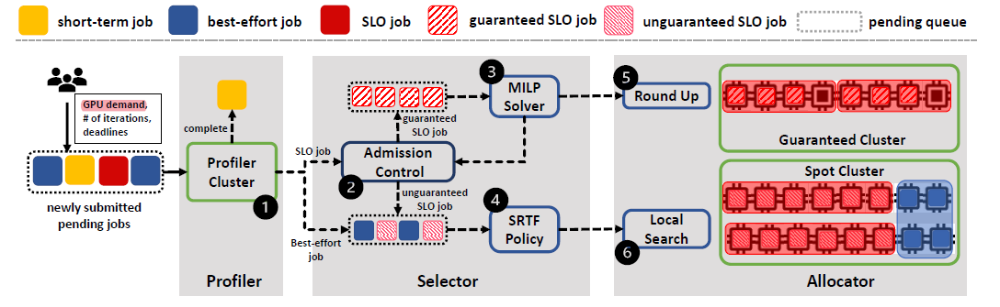
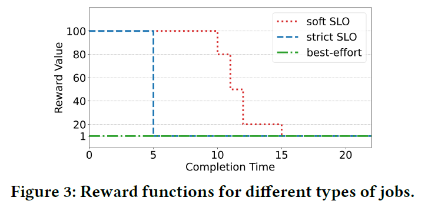

本文要讨论的是新加坡南洋理工大学S-Lab的Wei Gao博士发表在SoCC'21上的论文：**Chronus: A Novel Deadline-aware Scheduler for Deep Learning Training Jobs[[PDF]](https://yezhisheng.me/publication/chronus/chronus.pdf)[[Code]](https://github.com/S-Lab-System-Group/ChronusArtifact)**

<!--more-->

**摘要：** 现代GPU集群以分布式训练的方式支持深度学习训练任务(Deep Learning training，DLT)的训练。高效的任务调度是提高训练性能、资源利用率和用户间公平性的关键。不同类型的训练任务在完成时间和资源需求上的目标不同，因此如何在大规模GPU集群场景中合理调度有限资源来有效满足不同任务的差异化训练需求是一个值得研究的问题。

**关键词：** GPU数据中心，深度学习训练，集群管理系统，截止日期感知调度器

# 背景和挑战

GPU集群中存在多样化的训练任务，主要体现在资源需求量的不同以及对任务完成时间敏感度的差异上。根据需求大致可以分为两类，分别是具有服务水平目标(Service Level Objective，SLO)的任务和尽力而为(Best-effort，BE)的任务。其中，SLO任务通常具有特定的完成时限(deadline，ddl)要求，违规行为可能会造成巨大的经济损失；尽力而为任务对完成时限不敏感，但是期望尽快完成。

因此，Chronus研究的问题是：如何设计一个DL调度器，来有效满足不同类型任务的各种训练需求，即保证SLO任务的完成期限的同时，最大限度地提高BE任务的训练性能？

这项工作存在两大挑战：

挑战一：现有DL调度器主要是为了提高系统的训练效率（如降低任务完成时间、降低能耗或经济成本）或公平性而设计的，缺乏对SLO需求的显示支持，因此并不能保证在ddl之前完成任务。而现有考虑到ddl的DL调度工作只有两项（[HyperSched](https://dl.acm.org/doi/pdf/10.1145/3357223.3362719)和[GENIE](https://jianbinfang.github.io/files/2019-07-29-tpds.pdf)），并且，这两项工作没有考虑SLO任务和BE任务混合的情况。

挑战二：虽然之前为传统的高性能计算任务、大数据任务等设计了很多ddl感知的调度器，但是DLT任务表现一些出了与传统任务不同的独特特征，导致这些调度器可能不适用于调度DLT任务。

>对于GPU数据中心场景中深度学习任务的调度问题研究，可详见该作者于2022年发表在arXiv的一篇综述：Deep Learning Workload Scheduling in GPU Datacenters: Taxonomy, Challenges and Vision[[PDF]](https://arxiv.org/pdf/2205.11913.pdf)[[Code]](https://github.com/S-Lab-System-Group/Awesome-DL-Scheduling-Papers)

# 研究动机

## 深度学习训练的SLO需求

Chronus非常大的一个贡献就是进行全面的用户调查(其中52%的参与者是学生，16%的参与者是研究人员，32%的参与者是工程师)，以揭示DLT任务的SLO需求，调查结果如下:
<ol>
<li>普遍支持混合的SLO任务和BE任务</li>
<li>60%的参与者对JCT(Job Completion Time，任务完成时间)有明确的期望</li>
<li>约3%、12%、21%、22%的参与者可以接受0%、5%、10%、20%的ddl延迟</li>
<li>用户很难估计DLT任务的执行时间 </li>
</ol>

## SLO执行的挑战

该部分是对挑战二的详细阐述：
<ol>
<li>任务完成时间是ddl感知调度器设计的前提，但问卷结果4中表明用户很难估计DLT任务的执行时间，因为DLT任务的执行时间受到多个因素的影响，如资源拓扑、模型特征、batch size、迭代次数</li>
<li>任务选择是保证SLO任务的ddl和减少BE任务延迟的关键步骤，包括对SLO任务的接纳控制、BE任务的调度决策</li>
<li>分布式的DLT任务的运行速度高度依赖于所分配的GPU拓扑结构，这主要影响DLT任务的通信时间。而现有的ddl感知调度器至考虑可用资源的数量，忽略了它们的拓扑结构，可能会导致任务错过其ddl</li>
</ol>

# 系统设计

>注意，Chronus使用的是具有同构GPU资源的数据中心场景

图1：Chronus系统流程图

## 系统流程

(1) Profiler过滤掉短期或有bug的DLT任务，并估计集群用户提交的长期任务的完成时间①。

(2)分析完成后，Selector执行接纳控制，检查并将每个SLO任务标记为有保证(用户指定的ddl是可以实现的)或无保证(ddl难以满足)②。对于有保证的SLO任务，利用MILP求解器来识别需要调度的任务③。对于无保证的SLO任务和BE任务，使用SRTF(最短剩余时间优先)算法选择任务④。

(3) Allocator将GPU分配给选定的任务。对于可保证的SLO任务，采用Round-Up技术⑤来探索GPU应用的整合解决方案。对于SRTF选择的其他工作，执行本地搜索算法以确定有效的任务放置方案⑥。

## 系统设计亮点

### ***Profiler***：基于单/双节点的任务执行时间分析

通过上述系统流程图可知，用户需要提交DLT任务及其相关信息，包括GPU需求、ddl、训练迭代次数。

过去的Profiler使用的是GPU请求数量的资源来分析任务的执行时间，这就会需要一个大型的Profiling集群来支持这项工作。这种做法会降低集群资源利用率。为了解决这个问题，作者提出一个转换方式，具体为对于具有任意GPU需求的任务，都可以通过使用单/双节点来估计其运行速度。当然，这与DLT任务的可预测性有关系。

对于DLT任务的可预测性，可具体看北航Wencong Xiao博士的大作[[Gandiva]](https://www.usenix.org/system/files/osdi18-xiao.pdf)，蹲一波笔者后续对于该文章的详细解读。

具体的估算公式非常容易理解，可直接看文中的阐述。

>注意：这个公式来自于参考文献[[55]](https://www2.eecs.berkeley.edu/Pubs/TechRpts/2020/EECS-2020-136.pdf)(而不是[GENIE](https://jianbinfang.github.io/files/2019-07-29-tpds.pdf))，是UC Berkeley的Yang You博士的毕业论文。经过考证，此处是作者写错了。但是此处依然存在疑问，笔者无法get到Yang You博士是如何得到或者总结到这个结论公式的。

### ***Job Selector***：基于租约的SLO任务的接纳控制

简单理解，此处的租约也就是离散的时隙化系统中的每个时隙。任务在获得租约后，能够在该租期独占请求的GPU资源。此处可体现弹性训练的思想，即动态调整每个任务获得的租期。而对于弹性训练的普适定义，可参考作者的综述[[PDF]](https://arxiv.org/pdf/2205.11913.pdf)的3.2.3章节所述。

对于具体的给哪个任务分配哪个租期的决策，由一个MILP求解器来决定。整个建模过程比较简单，核心思想就是看某个任务在这一轮决策中能否到达第p个ddl及其训练效益。这主要与不同类型任务的差异化的ddl的表达式有关。

图2：不同类型任务的奖励函数

>注意：约束(3)写错了，按照该约束的物理意义，此处应该是任务请求的GPU数量，而不是其执行估计时间。

具体的建模过程可直接看原文。

对于每个SLO租期和BE租期的长度，作者是根据经验设置，根据文中提供的原因分析，笔者认为这样设置是可行的。

### ***Allocator***：基于Round-Up策略的资源分配

采用基于整合策略的任务放置/资源分配方案，可以达成两个目标：

（1）整合放置思想可以减少任务的通信开销：DLT任务具有放置敏感性，即不同的任务放置方案（任务使用的所有计算节点是否位于同一台物理服务器上）造成的通信开销不同。不合理的任务放置方案容易造成通信瓶颈，进而影响整个任务的完成效率。

（2）整合放置思想可以缓解资源碎片化：由于每个任务所需的计算节点数量存在较大的随机性（即使是用户在提交任务时指定），随着训练任务的增多，很容易造成资源碎片化问题。

为此，Chronus考虑一个每个物理服务器上都具有8个同构的GPU的集群，并认为，具有{1,2,4,8n}(n是整数)请求GPU数量的任务为整合友好型任务，其余数量的是整合非友好型任务。这主要与其提出的Proposition有关，非常好理解，具体如下：

图3：提出的proposition和相应的证明

对于所有整合友好的任务，直接利用Proposition中的思想进行资源分配。对于整合非友好的，还需要对请求的GPU数量进行Round-Up操作，也就是把数量变为{1,2,4,8n}

>注意：公式(6)写错了，RoundUp的是GPU数量，而不是任务的执行时间，这样也能对齐该公式的物理含义。

同时，笔者对这种资源分配方式提出质疑：首先，假设前提是具有同构8-GPU的集群场景，局限性较大，或者说，提出了这个方法，然后假设了这么一种场景。但是阿里[[22'NSDI]](https://www.usenix.org/system/files/nsdi22-paper-weng.pdf)的生产数据来源于异构的集群环境，所以在贴合实际方面存在一定偏差。其次，虽然作者在文中强调“整合非友好型的任务并不常见”，但假设任务刚好请求了10个GPU，按照文中所说，要给该任务分配16个，但是为什么不能是8+2呢？

## 实验

论文的复现工作已经完成，在此特别感谢论文作者Gao Wei博士不厌其烦的帮助。

# 写在最后

总体来说是篇不错的论文，文章内容很充实，给笔者的启发性很大。希望本真菜鸡也能尽快写出类似质量的论文。

***Maybe: Start Your Own Work With Appreciating The Good Ones!***

***

BGM：再见深海（微亮的瞬间）--唐汉霄