笔者近期在复现武汉大学的Wang Ne博士于2022年发表在网络通信领域顶刊IEEE Journal of Selected Areas in Communications(JSAC)上的一篇论文[2]，主要是在云边协同场景中利用抢占调度的方式实现深度学习任务的平均任务完成时间(JCT)最小化问题。本文是对该论文的深入分析与探讨。

直到开始复现这篇论文，笔者才深刻的认识到一个非常严肃的问题，那就是笔者之前可能根本没有真的读懂过这篇论文。这包含多个方面，也是读者在下文中要重点赘述的部分：

（1）做的问题是什么？

（2）实现调度的方法或者技术手段是什么？

（3）算法设计的思想？

（4）如何完整推演或模拟某个任务的调度过程？

（5）如何复现论文并成功运行？

（6）明显优势？存在的问题/不足？如何改进？

## Q1：问题定义

这篇论文考虑的是在云边协同场景中对分布式机器学习训练任务进行调度，以实现任务的平均完成时间最小化。主要关注的是如何利用抢占的方式，如何抢先地给一些任务分配worker和ps资源。我们首先需要看一下对于这个问题的一个数学表达，也就是模型(2)。

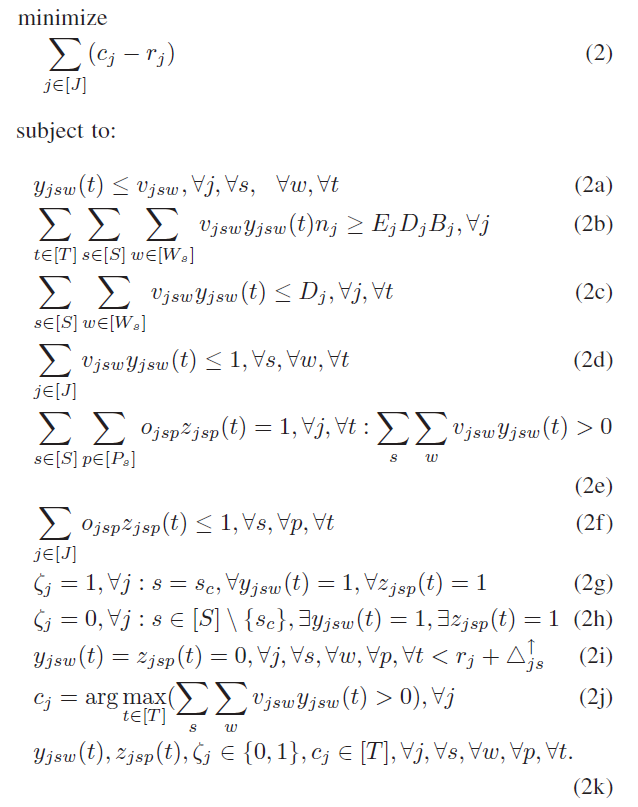

图1：最小化DML任务的JCT问题

为了理解模型中每一个变量及符号代表的物理意义，下面是其解释：

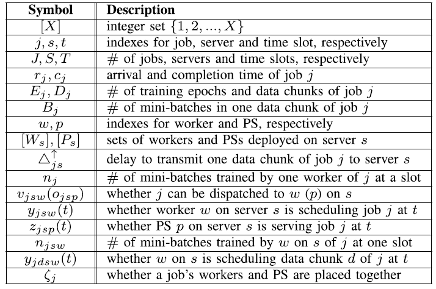

图2：符号及其描述

然后我们来逐条解读约束条件：

约束(2a)：$o_{jsw}$ 是一个二元变量，表示能否将j指派给server s上的worker w，这个值是在任务j释放时就要立即确定的。对于如何定义“释放：release”这个词，通过文中的一个对偶变量$\beta_{sw}(t)$的物理含义及所属时间单位可以确定，“释放：release”指的是任务的到达时间$r_j$。这条约束表示的是任务j只能分配给合格的worker，但是依然存在一个问题，那就是如何判断一个给定的worker w是否能够为任务j提供服务。笔者多次带着这个疑问读论文，在文章正文中依然没有找到可以解释这个问题的语句。但按照读者的理解，这应该与该服务器上的存储容量、worker w上的负载、worker w的gpu算力是有关系的。

    插播一个术语区分：

    Dispatching problem（分发问题）：每个任务应该被分发/指派到哪个服务器上
    Scheduling problem（调度问题）：在服务器上按照什么顺序执行任务

约束(2b)：表示需要给任务j分配足够数量的worker，$n_j$表示的是任务j的处理能力，即一个可以被指派给任务j的worker在一个时隙(one time slot)内可以训练的mini-batch数量。对于$n_j$的具体解释，可以直接看原文，很清晰。但$n_j$中包含一些隐藏信息，这与后面模型的演变是息息相关的。如果任务j分配的worker和ps之间需要进行跨服务器通信，则具有通信时间，而当worker/ps如果是以docker的形式实现的时候，$b_j$表示的其实就是docker内的预留带宽，这个是非常容易理解的，也可以直接查证[[OASIS '18-Infocom]](https://ieeexplore.ieee.org/abstract/document/8486422)。所以$b_j$实际上就是$b_w$，而w虽然是一个实例化的worker，但可以代指同一个类的所有worker。这与python中类和实例化对象的理解是一样的。毕竟，一旦任务到达，就要为任务j指定worker的类型。其实笔者认为此处的处理不如[[DPS '22-TMC]](https://ieeexplore.ieee.org/abstract/document/9847354)中需要求解任务的类型更好，但如果加上任务的类型选择，确实会给这个问题再增加一层难度。
不等式右边是任务j需要训练的总mini-batch数量。所以这条约束就是在确保任务分配的资源及其处理的量是比需要训练的量大的。

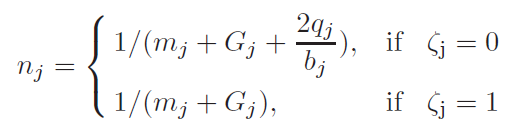
图3：任务j的处理能力建模

    epoch：训练完一个数据块中的全部mini-batch一次/轮
    iteration：迭代次数，一个epoch中训练mini-batch的次数，即训练完一个mini-batch一次就是一次迭代，也就等于mini-batch的数量

在读者看来，约束2b存在一个问题，使用$v_{jsw}$和$y_{jsw}(t)$变量已经为模型设置了抢占思想，举一个很简单的例子，如图4所示。约束条件只能满足总的需要的训练轮次，而不能保障每个数据块都能训练$E_j$个epoch。

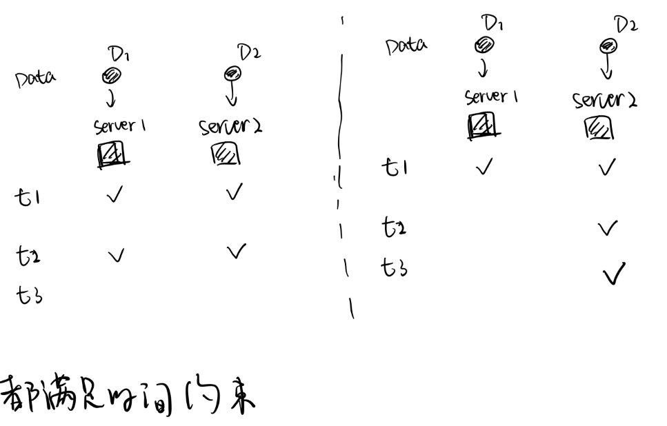
图4：约束2b问题举例

约束(2c)：限制分配的worker的数量最多为$D_j$个，以确保一个数据块最多由一个worker训练。

约束(2d/2f)：确保每个worker/PS在每个时隙最多可以训练一个任务

约束(2e)：确保为每个ML任务分配一个PS

约束(2g/2h)：对于任意任务j，如果服务器是云服务器，任意的任务在t时隙都有可以正在调度的任务，那么$\zeta_j=1$；而对于除云服务器之外的其他edge servers，存在这种情况，那么$\zeta_j=0$。说明，只与把任务放到cloud上才能一直没有通信开销

约束(2i)：任务只有上传到服务器s后，才给它分配资源

从模型(2)中我们可以梳理出这个问题需要决策的变量：

决策变量：$y_{jsw}(t)$、$z_{jsp}(t)$

辅助决策变量：$c_j$、$\zeta_j$、$n_j$、$o_{jsw}$、$o_{jsp}$

## Q2：问题求解

根据对模型的分析可知，模型(2)是一个MINLP问题，也就是混合整数非线性规划问题。所以即使是在离线情况下，该问题也是NP-Hard的。并且，这些决策变量之间存在耦合关系，其中，$y_{jsw}(t)$和$z_{jsp}(t)$变量确定使用哪个worker和ps，这会对$n_j$产生影响，而$n_j$表示的是一个时隙内能处理任务j的mini-batch的数量，所以对JCT也有影响。同时，非常重要的一个点，这个论文的思想是抢占！！！抢占！！！抢占！！！

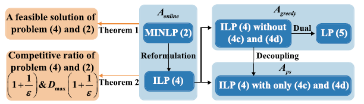
图5：在线算法的主要思想

所以为了求解MINLP问题，作者进行了问题重构，变成了ILP问题(4)。这里使用了一个转化思想。也就是对于所有的任务集合来说，直接计算每个任务j的jct =（完成时间-到达时间），是可以等价于一个更加细粒度的计算方法的。由前面的约束条件(2c)可知，每个数据块只分配给一个worker进行处理，同时每个任务具有$D_j$个大小相同的数据块$d_j$，只要找出完成时间最晚的数据块，那么这个时间就是任务j的完成时间。

这种转化也是抢占调度思想的来源，因为考虑的抢占调度是：

<ul>
<li>分配给同一个worker的任意任务都可以随时抢占该worker，如果任务被抢占，它将被挂起，其数据集仍存储在worker上，这就消除了数据集迁移造成的迁移开销</li>
<li>采用一种细粒度的抢占方式，即允许任务部分抢占分配给其他任务的worker，而不是抢占所有worker</li>
</ul>

因此，只要将整个任务分解到数据块粒度，才能操作每个worker上的抢占情况及调度时间表。

基于上述思想，作者采用不相关并行机模型（Unrelated Machine Model），通过计算每个数据块的平均分数流时间来替换之前的($c_j - r_j$)。对于这两个专业术语，如果直接去看给的参考论文，笔者个人认为初读的时候是难以理解的。

>不相关并行机：一个任务在服务器中的处理时间计算为任务大小除以服务器的计算速度；那么，虽然机器不相同，但不同服务器中的任务处理时间是相关的。假设一个一般设置，其中每个任务在每个服务器中都有一个与机器相关的处理时间，并且不同服务器中的任务处理时间之间没有关系，可用于调度无法拆分且具有固定处理时间的作业。
>
>
>任务的流时间：在系统中任务花费的总时间，即任务的完成时间和发布/释放/到达时间之间的差，是对多个异构机器上的任务在线调度问题性能评估的指标

是不是读不懂？起码笔者开始的时候是这样的。但是可以直接理解本文中要解释的意思。

首先，不相关并行机模型的一个非常重要的特性就是“同一计算任务在不同服务器上的处理时间均不相关且成不均匀的比例，可用于调度无法拆分且具有固定处理时间的作业”，简单理解，就是任务j此时已经拆分成了$D_j$个数据块，每个数据块可能被分配到不同的server上，最起码是不同的worker上，而如果某个worker如果被别的任务的数据块抢占了，并不影响其他worker上的任务j的数据块的运行。

其次，对于平均分数流时间，可以直接解读模型(3)的定义：

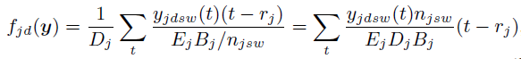
图6：数据块d的平均分数流时间模型

模型可以解读为$1 / D_j * XXX$，这个XXX就是任务的总分数流时间，使用$1 / D_j$是为了表示平均到每个数据块上。

总分数流时间 = 任务j的数据块d在服务器s上worker w的训练累计时间和 / 在服务器s上worker w上训练数据块d需要的时隙。一句话概括就是数据块d在worker w上的训练进度

注意：此处$n_{jsw}$是变量$n_j$和$v_{jsw}$的结合，如果$v_{jsw}=1$，那么$n_{jsw}=n_j$，否则，$n_{jsw}=0$。

思考为什么用平均分数流时间表示？因为$\sum_t {y_{jdsw}(t)(t - r_j)}$不就是这个任务j的数据块d的（结束时间-开始时间）吗？而$f_{jd}(\textbf{y})$中的$\textbf{y}$是$y_{jdsw}(t)$的集合。

同时，使用这个“不相关并行机”模型是与算法2-A_greedy有关的。参考中国科学技术大学孟佳颖博士的毕业论文的第二部分内容，可知在近似算法和在线算法的设计与分析中，有一些常用的基本技术，比如贪心和局部搜索，通过做出一系列优化某些局部选择的决策来工作，虽然这些局部选择可能不会导致最优的整体方案。对于不相关并行机问题的贪心调度算法来说，就是将任务分派到当前负载最轻的机器上去处理。那么不同机器上结束处理的时间主要取决于最后一个完成的任务。如果最后完成的任务处理时间短，那机器之间的差别不会太大。因此在分派之前，我们先根据任务处理时间的长短对任务进行排序，我们优先将处理时间较长的任务贪心的分派到当前负载最小的机器上。

可能直接说只能理解部分的算法意义，那么等读完算法设计，希望能明白这段话在这篇文章中体现在哪些地方。

    同时，对于该文章的理论分析方面，还需要注意一点：
    在不相关的机器模型上最小化JCT的问题是无界的。
    因为当产生排队后，所有后续任务的完成时间都会受到影响。
    因此论文使用速度增强(Speed Augmentation Model)来获得非平凡竞争比。

对于ILP模型(4)的约束条件，就和MINLP模型中的含义相同。

## Q3：算法设计

ILP模型(4)对worker和ps的分配与调度问题进行了解耦，从一个问题解耦成了两个问题，分别决定每个任务的$y_{jsw}(t)$和$z_{jsp}(t)$。

### Alg.1: 在线抢占调度算法框架

在总算法框架$A_{online}$中

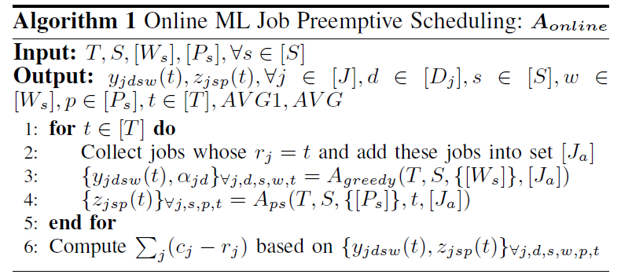
图7：在线抢占调度算法框架

在每个时隙：

（1）首先需要收集当前时隙到达的并加入集合$J_a$中；

（2）其次，为$J_a$中的每个任务调用一次算法$A_{greedy}$以安排分配到的worker资源，一旦任务j被调度，它的数据集就会上传并存储在分配给他们的相应的worker上。在这之后，如果任务j的数据块d在w上的schedule发生了变化，说明有其他任务对数据块d进行了抢占，数据块d只能延后执行。并且，这种抢占是随时可以发生的；

（3）等$J_a$中的任务全部确定了调度方案后，即都执行过一次$A_{greedy}$后，再给正在运行的任务执行$A_{ps}$来分配PS；

（4）最后计算所有任务的JCT值

笔者认为应该在end for之前加一句伪代码，实现将$J_a$集合置空。

>此处需要插播一个笔者以往的认知错误。笔者在读这篇文章的时候，一直认为，每个worker是能够准确知道下一个数据块d要在什么时候执行以及执行多长时间的。实际上这种认知是非常错误的，其实worker就相当于server的，本质上是一样的。对于一个机器来说，它是不知道上面这些信息的，它只知道按照排给它的顺序依次执行，至于要在什么时候开始执行以及执行多长时间，机器都是不知道的。举个例子，t时隙worker w上的安排是依次执行数据块{1,2,3,4}，然后(t+1)时隙发生了变化，变成了{1,3,2,4}，其中数据块1一直在执行，所以数据块1后要执行的是数据块2还是3，worker都不关注，唯一关注的就是执行顺序。

此外，可能有人会质疑“在线调度”体现在什么地方，笔者在前面的[[blog]](https://qingweiji.github.io/2023/04/13/Primal-Dual-Approximate-Algorithm-Based-On-LP/)中提到过，在线问题的特点是这种决策不能延迟，也不可撤销。因此，对于本文来说，我们收集并存储在$J_a$中的任务是当前时隙到达的，我只对这个集合中的任务进行调度决策，而对于前一个时隙，前前一个时隙的任务已经被调度完了，所以就相当于剔出$J_a$了。并且已经完成调度的任务不会被改变，而后面到达的任务可能会被插入到前面时隙到达任务的顺序前去完成。而这些决策是不可撤销的，这就是在线调度的体现。

### Alg.2: 在线worker的分配与调度

由于对ILP问题进行了解耦，所以这部分的内容在ILP模型中是不包含约束条件(4c-4d)。

论文为每个worker的调度引入了一个数据块处理规则，叫最高平均处理速率优先规则来处理worker上的挂起数据块队列。其中，任务j的每个数据块d的平均处理速率定义为:

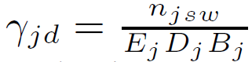
图8：任务j的每个数据块d的平均处理速率

很容易理解，因为分母是任务j要训练的mini-batch总量，分子是一个时隙能处理的任务j的mini-batch量。

引入这个变量的是为了通过对比每一个要分配到worker w上的数据块d的处理速率与worker w上挂起数据块中数据块d'的处理速率，来确定数据块d的一个平均训练时间增量值，也就是$Q_{jdsw}$，其计算方式如下所示：

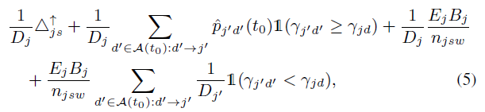
图9：时间增量Q值的计算公式

牢记一个事情哈，那就是$1 / D_j$的目的是平均到每一个数据块上，这个的前提也是任务j的每个数据块大小都是相同的。

（1）第一项：数据块d的平均传输延迟

（2）第二项：此处直接跳转到CALCULATEQ函数中的第10行，可以知道worker上挂起的数据块在worker到达时描述为$A(t_0)$，其中$t_0$等于任务的到达时间+上传到这个服务器的传输延迟。现在需要通过直接插入排序的方法将数据块d插入到$A(t_0)$中，并且将处理速率大于$\gamma_{jd}$的数据块放在A1队列中，小于的放在A2队列中。因此，此处的d'就是属于A1队列里的数据块，数据块d需要等待A1队列中的数据块全部处理完，才能执行到它，而需要等待的时间就是这些数据块的剩余处理时间之和。并且，由于A本身就是挂起的数据块，所以A1也是，那么A1中数据块的剩余处理时间也就是每个数据块需要的处理时间，也就是第三项

（3）第三项：数据块的平均处理时间。服务器s上使用worker w 训练数据块d所需的时隙数*平均到每个数据块

（4）第四项：此处的数据块d'就是A2队列中的数据块，所以A2中的数据块被d抢占了，那么就只需要等待数据块d的处理时间，这是由于被抢占造成的延迟时间

有了对Q的理解，我们可以直接来看算法$A_{greedy}$ 。

设计这个算法的目的是为了确定每个任务如何分配它的每个数据块并决定数据块的调度窗口，以实现JCT最小化

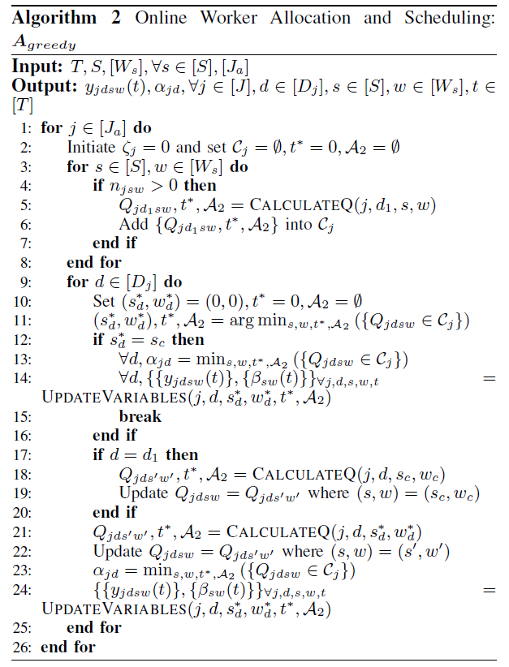
图10：在线worker的分配与调度

对于当前时隙收集到的每个任务j：

（1）初始化：设置了一个变量$C_j$来记录任务j调用CALCULATEQ函数后的结果，$t^*$是任务j第一次被调度的时间，由上面的分析可知，每个任务只调度一次$A_{greedy}$算法，A2是处理速率小于d的挂起数据块队列（也就是被抢占的数据块队列）。

（2）3-8行：遍历所有服务器上的worker，如果$n_{jsw}>0$说明这个worker可以分配给任务j使用。那么就利用任务j的第一个数据块的信息和使得$n_{jsw}>0$的server以及worker信息计算Q值，$t^*$和A2。并把每一个的这些信息存储在任务j的$C_j$集合中。此处可以直接跳到CALCULATEQ函数的解析部分先了解一下。

其实任务j可以随便输入任何一个数据块的信息，因为对于任务j来说每个数据块都是一样的，使用d1也仅仅是为了方便表示。这一段其实是对任务j在每个worker上可能的调度情况的一个初步估计，存储的这些值是完全与w有关的。比如w上的当前负载。

下面是对任务j的每个数据块的的真正安排与调度。

（3）对于任务j的每个数据块d：

①对$C_j$集合每个worker上的元素值按照Q值的大小升序排列，并从中取出Q值最小的情况，这种情况中的server和worker描述为$s^*$和$w^*$，记录这个Q值后面跟着的调度时间和抢占队列

然后考虑两种情况：

②12-16行：如果这个取最小Q值的服务器刚好是cloud，那么对于数据块d来说，Q值不变，因为云上不允许抢占，所以Q值的计算只需要第一项和第三项，这在CALCULATEQ函数的第八行，然后$t^*$就等于任务的到达时间+传输延迟，A2也是空集。所以这里Q值不用再去计算了，只需要继续取出那个Q值最小的solution就可以了。并调用UPDATEVARIABLES函数来更新变量$y_{jdsw}(t)$和$\beta_{sw}(t)$，其中$\beta_{sw}(t)$表示的是在时隙r时服务器s上worker w上所有未完成数据块的总平均权重，也就是$A(t_0)$中的全部数据块。往往任务的权重表示一种调度的优先级关系。

此处可以直接跳转到CALCULATEQ函数解析部分。在这部分中，在相应的时间范围内$y_{jdsw}(t)=1$。由于A2是空集，所以不需要执行3-7行。同时云上也不需要计算Q的第二项，说明也没有A集合，那么， $\beta_{sw}(t)=0$

③然后再看是不是第一个数据块。如果是第一个数据块，就重新计算数据块在cloud上的Q值，并重新把这个值更新为当前最小的Q

​    笔者在此提出本篇论文的一个缺点，就是伪代码逻辑性存在一些问题。根据算法设计部分的文字赘述，10-22行应该是在考虑将第一个数据块分配到云上还是edge上的两种情况，但显然，伪代码中呈现的意思并不完全与文字相符

④如果既不是分配到cloud上，也不是第一个数据块，那么从$C_j$中取出来的这个最小的Q值会被重新计算，因为w上的挂起队列可能发生了变化（在遍历每个数据块），并且刚开始计算的Q值是对任务j的分配情况的一个初始计算，然后依次更新变量

贪心算法是个局部最优问题，只能目光短浅的安排当前时隙的任务的调度方案，为他们计算目前最优的策略。笔者在前期复现论文时一直认为算法中一定有什么地方时要去调用求解器去求解模型的，然后确实没有。它采用的是基于LP的贪心算法去求解，这种方法也是非常实用的。

### Alg.3：计算时间增量Q

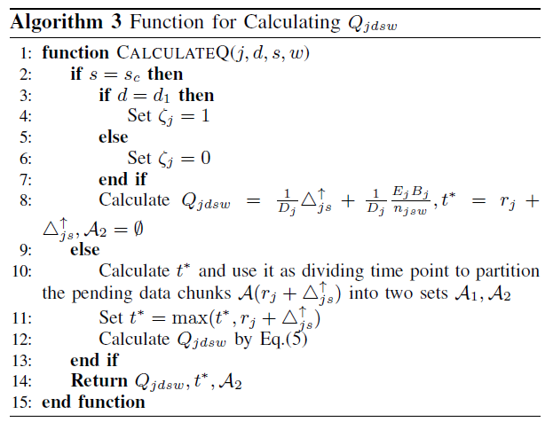
图11：Q的计算函数方法

如果任务j的第一个数据块分配到cloud上了就把剩余的数据块全都放在cloud上($]\zeta_j=1$)，Q只需要计算第一项和第三项，说明云上没有挂起的数据块，且云上不允许抢占，自然没有A2

如果既不是cloud也不是第一个数据块，就按照$\gamma_{jd}$的值来处理成A1和A2两个队列，然后记录最大的时间，并按照要求计算Q值

    此处其实有个坑，这个事情可能在单纯看论文理解如果计算cloud上的Q值是无法体会的，要通过复现的过程得到这个信息，毕竟没有直截了当的写在论文里。
    既然对于云上的worker w的增量时间，只计算任务j的数据块d的平均传输延迟和平均处理时间，那就说明这个worker上不存在其他任何数据块，也就是说这个worker只用来服务数据块d，那么对于要把所有数据块传输到云上的任务无论有多少数据块，都会有一个完全属于这个数据块的worker在等着分配给它，那么这样做是否合理呢？或许在其他论文中不合理，但是作者在“System Overview”部分已经明确写到本文中使用的云是一个具有无限的计算资源容量的服务器。
    所以完全可以理解以及在复现代码时，为要传输到云上的数据块单独分配一个新实例化的worker对象，毕竟无限资源。

### Alg.4：更新变量y和β

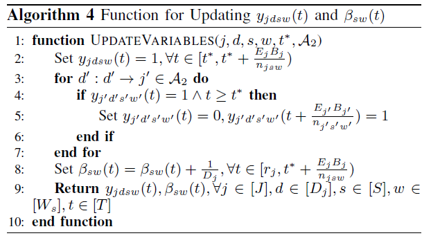
图12：变量更新函数

$\beta_{sw}(t)$表示的是在时隙r时服务器s上worker w上所有未完成数据块的总平均权重，也就是挂起队列A中的全部数据块

（1）如果时隙t至少是任务已经传输到服务器s上后且小于等于数据块d需要的处理时间，那么
任务j的数据块d（确定）在t时隙使用服务器s上的worker w（确定）

（2）对于抢占队列中的数据块，如果t时隙在使用worker w且$t>=t^*$，那么就令t时隙的y值为0，等到数据块d处理完后，再设置为1

（3）更新$\beta$的值，这个时间是从任务j到达到任务j的数据块d处理完

（4）返回y和$\beta$

>此处需要注意一点，就是算法第9行返回的更新后的变量值的任务范围是对于集合$J$里的任意任务j，因为都是分配到worker上的数据块，前面的一旦改变，后面的可能也会发生变化

### Alg.5：在线的PS分配

ILP模型(4)和约束条件(4c-4d)即构成PS分配问题的模型，与worker的分配模型是相互独立的。

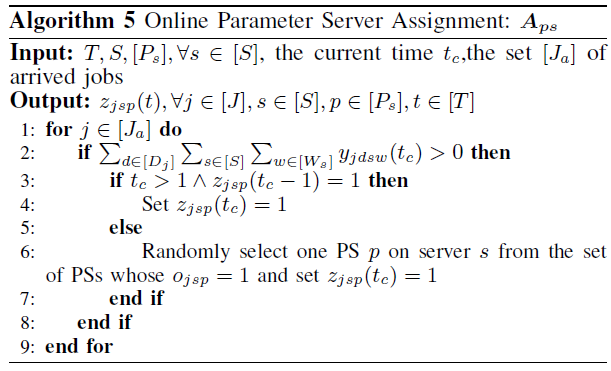

图13：A_ps算法

根据算法$A_{greedy}$可以得知，任务j的worker分配情况决定了它的ps是放在cloud上还是edge上。

由于每个任务只会分配一个PS节点，因此对于$J_a$集合中的任何一个任务：

（1）如果当前时间任务j的数据块d正在使用worker w，并且任务是在连续的时隙中执行的（比如时隙1-5一直在w上执行d），那么就保持分配的这个ps不变，以节省服务器的切换开销

（2）否则，就是所有可以指派给任务j的ps集合中($v_{jsp}=1$)随机选定一个分配给任务j并设置当前时隙服务于任务j

## Q4：系统流程模拟

在这里笔者简单的计算两个变量值，就是$n_{jsw}$和处理一个数据块需要的时隙数

首先，根据Simulation部分的setup，可以分别计算出不同$\zeta_j$时的范围值。当$\zeta_j=1$时，$n_{jsw}$的值在[19.98, 997]；当$\zeta_j=0$时，$n_{jsw}$的值在[19.96, 994]。这就意味着，一个worker w在一个时隙内可以处理大约20个到997个mini-bact，以time slot为单位。

继续计算，$E_j$随机取[20, 60]，每个任务的每个数据块都是58个mini-batch，那么一个worker w处理一个数据块需要的时隙范围在[1.16, 174]的范围内，以time slot为单位。也就是说，一个worker处理一个数据块最少都得1.16个time slot，而且在模拟时一个time slot是一个小时，最多就是174个小时（7.25天）。

>注意：T被设置的很大，大的足以完成所有的任务，所以不用担心T结束了但是任务还没运行完。

其他的模拟过程，可以通过代码调试出来，清晰可见。当然，也可以手动计算。

补充另外一个粗略的计算，其实ps更新参数的时间相比于worker的训练时间是非常小的，此处我们忽略不计。那么，还是重新计算$n_{jsw}$。依然取论文simulation部分给定的范围值。一个时隙就是一个小时。

$m_j \in [0.001, 0.05]$小时，换算成秒就是[3.6, 180]s。

$q_j \in [30, 575]$MB，$b_w \in [100, 5*1024]$Mbps。

那么处理一个mini-batch一次，也就是完成一次迭代需要的时间分别是：

$\zeta_j = 0$时，只有worker的训练时间，[3.6, 180]s；

$\zeta_j = 1$时，还包括通信时间，[0.011, 11.5]s + [3.6, 180]s = [3.611, 191.5]s。

那完成这个数据块的一轮训练（一个epoch）就是把所有mini-batch都训练一遍，由文中可知，每个数据块都是58个mini-bacth，所以结果如下：

$\zeta_j = 0$时，[208, 10440]s。换算成分钟为单位：[3.4, 174]min。换算成小时为：[0.056 ,2.9]hour

$\zeta_j = 1$时，[209.438, 11107]s。换算成分钟为单位：[3.49, 185]min，换算成小时为：[0.0581, 3.083]hour

频繁调整worker和PS部署是不现实的，所以每个时隙的长度设置的要比一个epoch的可能持续时间大得多。例如，一个时隙可以是1小时或更长时间

所以此处可以看出作者设置的一个小心思，也就是设置的一个时隙为一个小时，但是是针对一个data chunk的训练时间设置的。因为训练完一个数据块至少也得1.16个小时，这种尺度范围比较大的time slot是可行的。

## Q5：论文复现

对于论文复现，从笔者复现的情况来说，个人角度出发，不太建议复现本篇论文，一句话：隐藏信息比较多，存在逻辑性不强导致的理解歧义。但是如果想学习关于此类分布式机器学习任务的调度问题，可以参考[[Tiresias'19-NSDI]](https://github.com/SymbioticLab/Tiresias)、[[Optimus'18-EuroSys]](https://github.com/pengyanghua/optimus)以及[[Pollux'21-OSDI]](https://github.com/petuum/adaptdl)这些顶会上发表的经典论文的公开代码集。如果能按照自己的风格实现和源代码一样的功能，那就很厉害了。

关于复现这篇论文，大致需要以下几个文件：

1. main.py：主程序文件
2. Aonline.py：Aonline调度器的内容
3. jobs.py：Job类，包括解析trace_file
4. chunk.py：chunk类
5. model.py：模型架构和数据集信息
6. server.py：包括cluster类、server类、worker类和ps类
7. options.py：传入的参数及默认值
8. training_trace.csv: 处理好的trace文件，一般使用Microsoft Philly Trace。需要自己处理并合成为需要的workload。
9. settings/cluster_spec.csv: 应用场景的物理设施文件

## Q6：优势与不足

### 不足：系统资源利用率低

本篇论文有个非常严重的问题，那就是资源利用率可能不高。这与使用时隙来表示任务的状态是有关系的。

首先，需要明确$[T]$是一个整数集合，$t$是时隙的“index：索引”，这是一个离散时间系统。所以$t$只能取整数。那么$y_{jdsw}(t)$表示的是整个时隙t内任务j的数据块d都会使用服务器s上的worker w。

那么，问题是训练一个数据块可以把任意一个时隙段都占满吗？也就是worker在这个时隙里会一直运行吗？

笔者查证了最初的类似论文[[OASIS'18-Infocom]](https://i2.cs.hku.hk/~cwu/papers/yxbao-infocom18.pdf)，可以得知任务j的到达时间$r_j \in [T]$，任务的上传时间也是在整数的时隙中随机取。如果是cloud，那么上传延迟为[10, 15]个时隙；如果是edge，那么上传延迟为[1, 4]个时隙。这说明时间$t_0$（至少是到达+上传后的时隙）也是个整数。

但是在一个worker上处理一个数据块的时间计算是：一个数据块需要训练的mini-batch量 / 一个时隙能训练的mini-batch量。返回Q4，笔者在Q4部分进行了计算，得到的结果是[1.16, 174]。很明显，1.16个time slot并不能占满两个完整的时隙段，但是又需要向上取整来确保能够训练完这个数据块。所以即使第二个时隙无法完全用完，也不会分配给其他的数据块d。笔者的这个结论也可以由模型(4)的约束(4b)得到验证。这条约束的意思就是对于任意一个任务j到达后的时隙t来说，服务器s上的worker w在每个时隙只能服务于任务j的数据块d。这一点也可以在Alg.4的第二行得到验证。

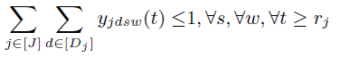

总的来说，就是worker存在在一个时隙内空闲的情况，也就是当前运行的数据块已经完全训练完了，但是又没法让这个worker继续按照安排给它的执行内容继续顺序执行。

所以从上述分析来看，这种方式会导致系统的资源利用率不高。当然，有个很明显的改进方案，那就是缩小时隙t的时长。本篇论文中时隙t设置为一个小时，这主要是考虑到频繁的调整worker和ps的部署时不现实的，所以每个时隙的长度需要比一个epoch的持续时间要大得多，比如一个小时或者更长。但是这种设置的思考对于本论文来说造成了一定的干扰，或者说让调度方案反而显得不那么灵活。但是，一个时隙的长度也不能太短，这样就会造成worker上频繁的切换以服务于不同的数据块，频繁切换以及暂停-保存机制本身就会带来较大的时间开销，反而可能更不利于系统的资源利用。 

### 优势：抢占开销

那么反过头来继续看一下Q值的计算公式，第二部分是数据块d需要等到前面的数据块（A1）全部训练完后才能执行到它，而第四部分是数据块d抢占了A2中的数据块，所以只需要等数据块d训练完成即可。

那么也可以理解为，本文的抢占是，对于分配到同一个worker上的任何数据块，都可以随时抢占这个worker，但是被抢占的数据块要保证是还没有处理的，所以执行抢占的那个数据块会被完全训练完。

而其他论文中的抢占往往是如下定义，参考[4]中的总结：

    主要通过checkpoint机制来对DL训练任务进行暂停和恢复，其中checkpoint是保存已经训练的模型参数的文件。
    抢占GPU任务的时间开销包括两部分：
    （1）等待正在运行的任务完成当前epoch的训练过程并保存checkpoint，即保存时间；
    （2）恢复被中断的任务。更具体地说，恢复过程包括重建DL模型，加载checkpoint，从服务器地HDFS（分布式存储系统）中重新传输训练数据，其中数据传输是最耗时的。

对比上述说法，可以看出本文设计的抢占的一个优势，那就是抢占的依然是没有处理的数据块，而不对正在处理的数据块进行抢占，虽然这个资源就是指那个worker。这就减少了checkpoint机制带来的时间开销。

## At the End

总的来说，这篇文章在抢占调度方案上的设计是可圈可点的，但是在论文撰写和伪代码算法的逻辑以及表达性和可读性上存在一定的缺陷或歧义，总的来说是一篇值得认真阅读并仔细琢磨的论文。

展开一点题外话说一下，这种调度方式只适合用于best-effort任务，也就是最小化任务的完成时间即可，对于具有ddl要求的任务来说，很可能会错过其ddl，毕竟训练完一个数据块至少也得占满两个时隙，即便新到的数据块的处理速率与挂起的相比是最快的，那也得等当前的数据块处理完，才能紧接着轮到它。

***Maybe: More than Enough is Too Much!***

-- Inspired by [[IEEE INFOCOM Best Paper'23]](https://infocom2023.ieee-infocom.org/awards) from Fei Wang, Ethan Hugh and Baochun Li (University of Toronto, Canada)

***

BGM：开始懂了/天黑黑/遇见 --- AI冷门歌手孙燕姿

## References

[1]Gu J, Chowdhury M, Shin K G, et al. Tiresias: A GPU Cluster Manager for Distributed Deep Learning[C]//NSDI. 2019, 19: 485-500.

[2]Wang N, Zhou R, Jiao L, et al. Preemptive Scheduling for Distributed Machine Learning Jobs in Edge-Cloud Networks[J]. IEEE Journal on Selected Areas in Communications, 2022, 40(8): 2411-2425.

[3]Li Y, Zhang X, Zeng T, et al. Task Placement and Resource Allocation for Edge Machine Learning: A GNN-based Multi-Agent Reinforcement Learning Paradigm[J]. arXiv preprint arXiv:2302.00571, 2023.

[4]Chen C, Chen Y, Chen Z, et al. PickyMan: A Preemptive Scheduler for Deep Learning Jobs on GPU Clusters[C]//2022 IEEE International Performance, Computing, and Communications Conference (IPCCC). IEEE, 2022: 120-129.

[5]Thorpe J, Zhao P, Eyolfson J, et al. Bamboo: Making Preemptible Instances Resilient for Affordable Training of Large DNNs[J]. arXiv preprint arXiv:2204.12013, 2022.

[6]Li J, Xu H, Zhu Y, et al. Lyra: Elastic Scheduling for Deep Learning Clusters[J]. 2023.