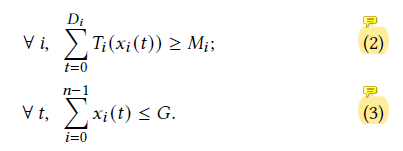

ElasticFlow: An Elastic Serverless Training Platform for Distributed Deep Learning[[PDF]](https://dl.acm.org/doi/10.1145/3575693.3575721)[[Code]](https://github.com/pkusys/ElasticFlow/tree/main/ElasticFlow)[[Video]](https://www.youtube.com/watch?v=99SiHtckGWc)是北京大学Liu Xuanzhe教授和Jin Xin教授团队发表在计算机体系结构/并行与分布式计算/存储系统领域A类会议ASPLOS'23年的一篇论文，其中一作是Gu Diandian博士，二作Zhao Yihao博士已经连续两年以第一作者身份发表了网络领域顶会Sigcomm论文。

本文是对ElasticFlow论文的深入分析与探讨。

<!--more-->

ElasticFlow[1]是一个面向分布式训练的弹性无服务器训练平台，聚焦于两点：

（1）保障Deep learning用户的SLO需求，即deadline

（2）以Serverless computing的形式来支持ML任务的弹性训练

也就是说，ElasticFlow的目标不是加速单个任务训练进程，而是在多任务调度场景下，利用ML workload的弹性以无服务器的形式为任务训练提供性能保障。

**我们需要带着以下几个问题，再过头来重读论文：**

**Q1：应用场景：**
论文中使用的是同构资源的单一集群环境？是否适用于异构资源的多集群呢？如TapFinger[[Infocom'23]](https://i.cs.hku.hk/~cwu/papers/yhli-infocom23.pdf)[2]中设置的multi-cluster edge network场景

**Q2：离线 or 在线 任务：**
论文中的训练任务都是离线的吗？如果是在线达到的任务呢？算法效果还会一如既往的好吗？

**Q3：non-linear scaling curve：**
关于每个任务在不同时间单位分配了不同数量的GPU资源后吞吐量变化曲线是如何得到的呢？其中每时间单位每个GPU的吞吐与什么有关？是否与GPU的类型以及任务信息都是息息相关的呢？

**Q4：任务放置：**
任务放置决策会如何影响任务的完成时间进而影响SLO性能保障？以及为了简化问题求解或者简化整个调度问题之间的耦合关系，如何解耦整个系统流程呢？包括准入控制、资源分配以及任务放置？此外，拓扑依赖的任务放置，考虑的拓扑是什么？这样做是否合理？

对于ElasticFlow论文的相关解析，也可以参考上海交通大学EPCC薛春宇博士的一篇文章，具体内容发表在了他的[[github]](https://github.com/DicardoX/Individual_Paper_Notes/tree/main/ElasticFlow)中，薛博士主要从整体设计以及逻辑方面来解析论文。

## Background And Motivation

我们首先给出几个关键词：指定GPU资源配置、考虑底层系统、聚焦于优化JCT。

将这三个关键词进行组合，即可得出现有的分布式深度学习训练任务的调度研究存在的以下几个问题：

（1）大多数已有工作需要用户提交/指定训练任务的具体资源配置，如GPU类型、数量等，包括经典工作Gandiva[[OSDI'18]](https://www.usenix.org/system/files/osdi18-xiao.pdf)[3]、Tiresias[[NSDI'19]](https://www.usenix.org/conference/nsdi19/presentation/gu)[4]

（2）大多数已有工作在调度系统设计上采用的都是以服务器为中心的模式，这样就将底层系统问题与DL任务调度问题进行耦合/绑定，使问题变复杂

（3）大多数已有工作关注的是如何提升系统效率（主要是降低任务的完成时间）、或保障任务之间的公平性，而对于保障任务的SLO需求的研究关注较少

### 对于问题（1）

已有许多研究提出了相应的解决方案，即在用户提交任务时无需指定具体的资源配置方案，如OASIS[[INFOCOM'18]](https://ieeexplore.ieee.org/stamp/stamp.jsp?tp=&arnumber=8486422)、Pollux[[OSDI'21]](https://www.usenix.org/conference/osdi21/presentation/qiao)，这是一种弹性的资源分配方式。其原因主要是DML任务的独特的特征会导致任务的完成时间无法准确估计，从而导致配置资源非常依赖于DL开发人员的工程经验。

    DML任务的独特特征包括：

    资源需求弹性[5]：使用不同资源配置时，任务所需要的完成时间不同
    
    放置敏感性[3]：任务的所有训练节点是否放置在同一台物理服务器上对任务的执行时间有影响
    
    资源消耗的不均匀性[6]：任务的运行速度通常是分配的资源量(worker数量)的凹函数，不是线性正比的
    --- 这一条对应着文中提到的non-linear scaling curve

在这里，笔者需要明确一个概念，那就是弹性训练包括几层意思。根据笔者阅读了多篇论文后，得出以下结果：

<ul>
<li>用户在提交任务时不指定资源配置，由调度系统弹性分配</li>
<li>在任务运行过程中，动态改变分配的资源的位置或数量，实现手段包括抢占、任务迁移等</li>
</ul>

***对于如何实现/支持弹性，笔者在之前的[blog](https://qingweiji.github.io/2023/03/26/How-To-Support-Elastic-Trainging/)中也已经提及。***

### 对于问题（2）

已有的工作确实基本都是以服务器为中心的形式，在这两年才有部分研究转向无服务器的形式。正如文中所说，以服务器为中心的形式，将DML模型训练问题和系统调度问题紧密的耦合在了一起。DML开发人员需要显式地请求具体的硬件资源并配置及其来运行训练任务。虽然现实情况是worker或者PS都是通过docker/VM的形式来使用，借助容器化的技术简化了系统配置并使得程序具有可移植性，但DML开发人员仍需要负责把任务相关的代码加载/包装到容器中。

更重要的是，由于绑定了底层系统，DML训练任务就会受到GPU等硬件资源的使用限制，因为DML开发人员面临基于GPU内存来调整本地batch size和决定每个时间单位分配给不同任务的资源数量的问题，这都是与底层系统息息相关的。这些问题既影响超参数的调整（如全局batch size、学习率等），也影响不同资源量下的scaling curve，从而对最终的任务完成时间产生影响。当任务训练目标为SLO性能保障时，极有可能无法满足任务的训练需求。

### 对于问题（3）

现有的为DML训练任务量身定制的ML调度系统工作中，确实很少关注任务的SLO需求，除了Chronus[[SoCC'21-blog]](https://qingweiji.github.io/2023/04/13/A-Deadline-Aware-Scheduler-for-DLT-Jobs%C2%B721-SoCC/)，笔者在之前的博客中已经详细解读该文章。据笔者所知，Chronus应该是第一个为具有SLO需求的DML任务专门设计的一个调度器。ElasticFlow与Chronus的有三点明显不同。

<ul>
<li>
调度系统目标：
<ul>
<li>
Chronus期望通过设计一个DL调度器，来有效满足不同类型任务的各种训练需求，即保证SLO任务的完成期限的同时，最大限度地提高Best-effort任务的训练性能。
</li>
<li>ElasticFlow的关注点在于为任务分配能够满足其deadline要求的最少的资源量，并尽可能提高集群的资源使用率</li>
</ul>
</li>
</li>
<li>
是否支持弹性训练：
<ul>
<li>Chronus严格来讲，是不支持弹性训练的，也就是说它所说的弹性与我们严格定义的弹性训练定义不符。Chronus中的弹性指的是动态改变任务的训练租期，但是训练使用的资源量和位置是不变的，相当于全部资源被抢占后挂起或者恢复训练。
</li>
<li>ElasticFlow是严格符合弹性训练的定义，用户不指定资源配置，以及训练过程中动态改变每个时间单位上分配的资源数量。
</li>
</ul>
</li>
<li>
以服务器为中心 vs. 无服务器：

Chronus是以服务器为中心的调度系统，这也是ElasticFlow与其对比的一个重点。根据文中总结的现有解决方案的限制的第二条为“Chronus仍然采用以服务器为中心的方法，缺乏弹性地扩展或者收缩任务资源量以优化集群资源利用率并满足deadline的灵活性”。笔者不太赞同第一点，因为现有部分研究已经证明以服务器为中心的调度系统依然可以实现弹性训练的，并部署在大规模集群中使用，比如阿里的ElasticDL框架。
</li>
</ul>

**此处我们存疑，带着疑问往下看！**

## System Challenges/DL Job Characteristics

在具体的系统设计之前，笔者将系统设计的挑战，更直白地说，是设计一个deadline-aware的DML弹性调度器的挑战，或者说由于DL任务的特征造成的困难，由于DL提前插播到这个章节中。

毕竟抛去serverless computing这种新形式不谈，以下两点才是弹性调度器设计上存在的挑战/难点。

### non-linear scaling curve

non-linear scaling curve，中文可以翻译为非线性规模曲线，这是设计系统设计方面的一个关键基本点。简单来说，就是在直觉方面，分布式训练中使用的worker资源越多，训练效率或者训练吞吐就会越高，呈现一种线性正比的关系。但实际上是由于参数同步和其他凯西奥，吞吐量并不会随着worker数量的增加而线性增长，而是一种次线性的关系，**即存在边际效应递减的现象**。这个对应于上面我们所说的DML任务特征中的第三条“资源消耗的不均匀性”。

图1：Scaling curves of popular DNN models[1]

图2：Training speed-up with different worker/PS numbers[7]

其中，图2是在不同数量的worker下（对于每一个数据点，PS个数等于 worker个数），和只有单个worker、单个PS的情形相比，所取得的训练加速。可以发现，训练加速并不随着PS（和worker）的数量呈线性增长。

因此，deadline-aware的DML弹性调度器在设计时应该考虑资源分配的这个特征，以确保分配的资源能够提供足够的吞吐使得任务在ddl前完成。

***注意：此处存在一个疑问，那就是这个non-linear scaling curve如何得到呢？这也是笔者在上面的Q3中提出的。***

### topology-dependent placement

分布式训练任务的性能不仅取决于分配的worker数量，还取决于这些worker的拓扑位置。这与worker之间进行参数同步时的通信带宽有关，通信带宽的大小会影响参数同步的速度，也就是影响通信时间。通信带宽的大小由workers的连接方式决定的。当任务调度场景为单一大规模GPU集群时，主要分为三种情况：

<ul>
<li>
分配的所有workers在同一台物理服务器(server)上：
通信可以使用PCIe(32 GB/s bandwidth for PCIe 4.0×16) 或者 NVLink(600 GB/s bidirectional bandwidth for third-generation NVIDIA NVLink)
</li>
<li>
分配的所有workers在同一个机架(rack)的不同物理服务器上：
通信带宽由网络决定，通常为40Gbps以太网，200 Gbps InfiniBand, 或者 8×200 Gbps InfiniBand用于高端GPU服务器
</li>
<li>
分配的所有workers在不同机架上：通常为带宽较低的局域网
</li>
</ul>

而当任务需要跨集群训练时，不同集群/数据中心之间是靠广域网连接的，此时带宽会更低，通信开销会成为任务训练过程中的瓶颈。

图3：Throughputs of different placements for 8-GPU jobs for two models ResNet-50 and BERT[1]

图4：Different sensitivity to intra-server locality for two models VGG16 and ResNet-50[3]

图4是经典论文Gandiva[3]中提供的一个关于“位置亲和性”特征的示例。

    根据文中的解释：
    多gpu DL任务的性能取决于所分配gpu的亲和性。不同的DL任务对gpu之间的亲和力表现出不同程度的敏感性。
    即使对于同一台机器上的gpu，由于不对称架构，我们也观察到不同级别的gpu间亲和性:
    两个gpu可能位于不同的CPU插槽中(表示为DiffSocket)，在同一个CPU插槽中；
    在不同的PCIe交换机上(表示为SameSocket)，或者在相同的PCIe交换机上(表示为SamePCIeSw)。

## Architecture Design

图5：系统架构

**输入：**

DL开发人员向系统提交需要训练的任务及其相关信息，需要包含以下参数：

（1）DNN模型

（2）超参数，即训练超参数，如全局批大小、学习率等

（3）终止条件，表示任务训练完成的标志。DL开发人员只需要指定迭代的最大次数，也可以添加其他条件，比如达到一定的精度

（4）deadline，这是DL开发人员对任务的SLO需求

（5）其他训练组件(如数据集、优化器等)

通过输入信息可知，用户只需提出自己的性能需求，并指定一些超参数，而系统层面的资源分配问题，则是由ElasticFlow算法决定的，如基于GPU内存来决定local batch size和给每个任务在不同时间单位上分配的worker数目。

**输出：**

任务一旦被接纳，其deadline一定能够被保障。训练结束的标志是在deadline前完成该任务需要的最大迭代次数。

根据图1中的系统架构，也可以很清晰的看出系统流程：接纳控制、资源分配、任务放置，其中集群的状态一直被监控，时刻为其他步骤进行做调整。

    注意：无服务器形式就不存在任务的训练模式是PS还是All-reduce，只通过任务的终止条件来判断是否完成训练

### Admission Control

此处使用**资源使用量(resource usage)= GPU数量 X GPU运行时间**，而非**资源量(如GPU数量)** 来确定任务$i$能够满足deadline的而需要分配的最小资源量，即最小满意份额(Minimum Satisfactory Share)。

对于满足linear-scaling-curve的任务，无论分配的GPU数量是多少，每个GPU的吞吐都是相同的。所以令$T_i(x_i) = {k_i} * {x_i}$表示为任务$i$的scaling-curve，也就是当分配给任务$i$的GPU数量为$x_i$并且每块GPU的吞吐都是$k_i$时任务$i$的吞吐。其中，$k_i$是由每个时间单位内一个GPU(通常看作一个worker)上完成的迭代次数来决定的。

***到目前为止，文中还没有提到如何得到任务的scaling-curve***

**定理：** 对任务按deadline升序排序，若任意任务$i$，前$i$个任务的GPU时间之和小于GPU总数*第i个任务的ddl，那么就存在一个合理的分配方案，能够保障所有任务的ddl被满足。

图6：定理表达式

其中，$M_j$是GPU $j$ 要运行的最大的迭代次数，即训练结束条件。$D_i$是任务$i$的deadline，G是GPU的总数。

可能有人觉得此处符号有点混乱，其实不是的。在算法1的第13行中明确说明：for $j$ from 1 to G do。这与刚开始我们提到的使用的是resource usage的定义是一样的，即GPU的数量*运行时间。

并定义了另外两个约束，分别用于满足任务的ddl(2)以及资源容量限制(3)。

图7：接纳控制约束条件

但是对于DML任务来说，他们的吞吐量曲线是非线性的，不能直接套用这个线性假设定理。文中采用了一种渐进式填充算法 (Prograssive Filling)，具体的算法思想非常简单，可以直接看原文，也可以看Xue Chunyu博士的[[文章解析]](https://github.com/DicardoX/Individual_Paper_Notes/tree/main/ElasticFlow)。此外，文中提供了一个案例，来模拟算法1的运行流程。

图8：ElasticFlow准入控制示例

图8为ElasticFlow的接纳控制示例。最后的结论是完成一个任务的GPU运行时间取决于其他任务的GPU使用情况。我们通过这个case来详细说明。假设图(a)为任务C的scaling-curve，使用1个、2个和4个GPU时，吞吐量分别为1、1.5和2。因此，如果用一个GPU训练一个任务需要一个时间单位，那么用两个GPU训练任务需要$\frac{2}{3}$个时间单位，用四个GPU则需要$\frac{1}{2}$个时间单位，所以使用1、1.5或2个GPU时“资源使用量”为1、$\frac{4}{3}$、2个时间单位。假设$D_c=2$，$M_c=3$，，并且此时系统中已经存在两个任务A和B，并且假设A和B分别需要在一个时间单位内使用1个和2个GPU。

如果$j=2$，那么任务C在第一个时间单位只能使用一个GPU，在第二个时间单位使用2个GPU。在这种情况下，$\sum_{t=0}^{2}{T_c({x_c(t)})={T_c(1)}+{T_c(2)}=2.5<{M_c}}$，意味着任务C在2个时间单位内无法完成。

如果$j=4$，那么任务C在第一个时间单位只能使用一个GPU，在第二个时间单位使用4个GPU。在这种情况下，$\sum_{t=0}^{2}{T_c({x_c(t)})={T_c(1)}+{T_c(4)}=3\ge{M_c}}$，意味着任务C在deadline（也就是$t=2$）前可以完成。也就是任务C的最小满意份额为第一个时间单位使用1个GPU，第二个时间单位使用4个GPU。

    注意：分配原则为“当为任务分配其最小的可运行份额时，资源使用将最小化”

### Resource Allocation

资源分配部分也是一直遵守 ***non-linear scaling curve*** 结论，或者叫 ***收益递减效应***（分配越多的GPU数量给任务$i$，则其消耗的GPU时间就越多）。

在上一步接纳任务后，再来确定分配给任务$i$的GPU数量，以最小化所有接纳任务消耗的GPU总时间为目标，约束包括三个：

(1) ddl满足约束：所有任务的 DDL 被满足；

(2) 资源容量约束：总分配 GPU 数目不超过当前可用 GPU 数目；

(3) 在下一个时间单位中所有 GPUs 均被分配，除非给任一任务分配更多资源都会导致执行更慢。

图9：资源分配模型

### Job Placement

在决策好给每个任务分配的GPU数量后，需要放置任务。这部分其实很多系统论文中都提出了相关的思路，比如作者提出的这个 ***Topology-aware job placement*** 在笔者之前写过的SoCC'21论文Chronus中就明确提出过。ElasticFlow中借鉴了HiveD论文中提出下hide多级架构集群模式。

## Recall the Starting Questions

其实笔者重读这篇论文，也是带着自己想要知道的问题去阅读的。现在让我们回过头来，重新看一下开头提出的那些问题，现在是否已经有了答案。

### Q1：应用场景

问题：论文中使用的是同构资源的单一集群环境？是否适用于异构资源的多集群呢？如TapFinger[[Infocom'23]](https://i.cs.hku.hk/~cwu/papers/yhli-infocom23.pdf)[2]中设置的multi-cluster edge network场景

回答：读完文章，根据模型和实验环境可以很明确的确定是具有同构资源的单一集群环境。但是根据近期国家的发展战略，跨域协同的智算中心场景，或者说东数西算正在大力推广。所以ElasticFlow框架是不适合用于具有异构资源的多集群环境的。

ElasticFlow中scaling curve只与每个时间单位分配的GPU数量有关，如果要适用于异构多边缘集群这种场景，还需要考虑GPU的类型，以及集群之间的负载均衡。此外，还需要考虑新到达任务的profiling部分要在哪个集群中进行。

### Q2：离线 or 在线 任务

问题：论文中的训练任务都是离线的吗？如果是在线达到的任务呢？算法效果还会一如既往的好吗？

回答：根据笔者的推断，应该是一批离线任务。如果是在线到达的任务，算法效果可能并不能达到离线所得，并且需要设计一个具有理论保障的在线算法机制，并分析竞争比。

### Q3：non-linear scaling curve

问题：关于每个任务在不同时间单位分配了不同数量的GPU资源后吞吐量变化曲线是如何得到的呢？其中每时间单位每个GPU的吞吐与什么有关？是否与GPU的类型以及任务信息都是息息相关的呢？

回答：最重要的是如何得到吞吐曲线。笔者认为，这个曲线的变化应该是与GPU数量（文中是同构资源）和任务的超参数（如全局batch size、学习率）等都是相关的。Chronus中是采取了Prof.You Yang的一个公式，ElasticFLow中根据第五章节***Throughput profiling*** 部分可知，直接使用不同数量的GPU来分析其吞吐，应该就是预训练。

笔者认为，对于吞吐值，可以参考两篇论文：**一篇是Peng Yanghua博士的Optimus，另一篇是Aurick Qiao博士的Pollux**，都是DML调度系统设计方面非常经典的设计方案。

### Q4：任务放置

问题：任务放置决策会如何影响任务的完成时间进而影响SLO性能保障？以及为了简化问题求解或者简化整个调度问题之间的耦合关系，如何解耦整个系统流程呢？包括准入控制、资源分配以及任务放置？此外，拓扑依赖的任务放置，考虑的拓扑是什么？这样做是否合理？

回答：根据上文中我们的分析可知任务在单一集群中有三种放置方式，不同任务放置方式下使用的通信带宽不同，继而得到的任务的完成时间也就不同，能否在deadline之前完成任务，是ElasticFlow是否接受该任务的关键。

ElasticFlow与其他大部分的系统论文相同，将任务的资源分配决策与任务放置决策进行了解耦，这在一定程度上简化了任务调度问题的复杂度，这也是系统论文常见的手段。具体来说，就是确定一个可行的资源分配方案，能够实现资源分配阶段的目标，在确定好GPU数量后，再确定具体需要服务该任务的GPU的位置。

拓扑依赖/感知，其实就是考虑了任务放置的多种情况，这在ML调度系统的经典论文Gandiva和HiveD中早就进行过分析了。

## Serverless or Server-Centric?

解决完上面的问题后，回到我们的题目：Serverless DDL Training is better?

纵观全文，Serverless是个新的模式，但是根据我们上面的分析，似乎ElasticFlow的设计套用到Server-Centric上也不是不可以？

是的，从笔者的角度来说，是可以的。笔者认为，ElasticFlow真正的创新点不在于模型训练的形式，而是设计了一个弹性的调度系统以保障任务的SLO需求，这才是ElasticFlow的核心点。

再往深里说，针对deep learning训练任务，弹性系统的设计本身就存在很多困难，文中主要总结的就是：资源分配的收益递减效应，和拓扑依赖的任务放置。

## At the End

ElasticFlow是首个在Serverless Computing模式下通过支持ML任务的弹性训练来保障任务的SLO需求的系统性研究。

从文章的可读性角度来说，论文作者的文笔和逻辑都非常好，很值得学习。

从代码的可用性来说，作者做得也是非常不错的，笔者近期正在复现ElasticFlow论文，非常值得笔者学习。

***Maybe: Compare the state-of-the-art jobs to make your progress!***

***

BGM：

童话镇 -- 暗杠

千金散尽 -- 杨宗纬

## References

[1]Gu D, Zhao Y, Zhong Y, et al. ElasticFlow: An Elastic Serverless Training Platform for Distributed Deep Learning[C]//Proceedings of the 28th ACM International Conference on Architectural Support for Programming Languages and Operating Systems, Volume 2. 2023: 266-280.

[2]Li Y, Zeng T, Zhang X, et al. TapFinger: Task Placement and Fine-Grained Resource Allocation for Edge Machine Learning[C]//IEEE INFOCOM. 2023.

[3]Xiao W, Bhardwaj R, Ramjee R, et al. Gandiva: Introspective cluster scheduling for deep learning[C]//13th {USENIX} Symposium on Operating Systems Design and Implementation ({OSDI} 18). 2018: 595-610.

[4]Gu J, Chowdhury M, Shin K G, et al. Tiresias: A {GPU} cluster manager for distributed deep learning[C]//16th USENIX Symposium on Networked Systems Design and Implementation (NSDI 19). 2019: 485-500.

[5]Zhang Q, Zhou R, Wu C, et al. Online scheduling of heterogeneous distributed machine learning jobs[C]//Proceedings of the Twenty-First International Symposium on Theory, Algorithmic Foundations, and Protocol Design for Mobile Networks and Mobile Computing. 2020: 111-120.

[6]Peng Y, Bao Y, Chen Y, et al. Optimus: an efficient dynamic resource scheduler for deep learning clusters[C]//Proceedings of the Thirteenth EuroSys Conference. 2018: 1-14.

[7]Peng Y, Bao Y, Chen Y, et al. Dl2: A deep learning-driven scheduler for deep learning clusters[J]. IEEE Transactions on Parallel and Distributed Systems, 2021, 32(8): 1947-1960.
